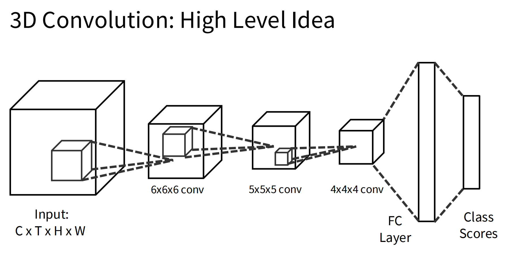

# Lecture 10

> Video = 2D + Time

## Video Classification

对一个动态的视频中的行为进行分类，比如running / swimming。

* 问题：单个视频量太大，不可能逐帧跑一遍。
* 解决：每隔固定帧数采样抽帧；采用不同抽帧方法最后平均处理。

我们从传统的**独立**分析每一张图转变为**结合**分析。

### Late Fusion

先把抽帧的每一帧过一遍CNN，然后采用

* (With FC) 摊平，扔给MLP，计算得分
* (With Pooling) 对时间和空间池化，扔给线性层计算得分

这两种方法。

### Early Fusion with 3D CNNs

采用3D的CNN形式计算得分。

#### 性能提升

* 运动学视角：分析光学模糊流动
  * Spacial 和 Temporal 两个维度做得分计算。
* 升维方法：2D -> 3D 地做分析

### Vision Transformers

将单帧图片按照区块网格划分出Tokens，并叠加。

问题：Token数量太大。

解决：

* Modify attention operator
  * 把token的时间和空间要素**分离**做Attention
    * 即先找time的Attention，再找对应的位置
    * from O(NT) to O(N + T)
  * 将Attention限制为时间+空间的三维的区块范围内
    * Very similar to 3D CNNs, but with self attention inside each cube.
  * Multiscale Vision Transformers
    * 事先通过卷积压缩 K/V 的尺寸
* Reduce the number of tokens
  * Tubelets: 将相邻的若干帧合并成一个token，包含住了运动信息
  * 其他方法

## Understanding

包括一些理解运用的领域：

* Classify short clips
* Temporal Action Localization
  * 看不同时间发生了什么动作
* Spatio-Temporal Detection
  * 看不同时间不同对象做什么
* Visually-guided audio source separation
  * 分清楚声音是谁在讲话
* Musical instruments source separation
* Audio-Visual Video Understanding
* Efficient Video Understanding
  * 对多个clips运用classifier
* Multimodal Egocentric Video Understanding
* VideoLLMs
* Long-form Video Understanding
  * 长时间视频理解
