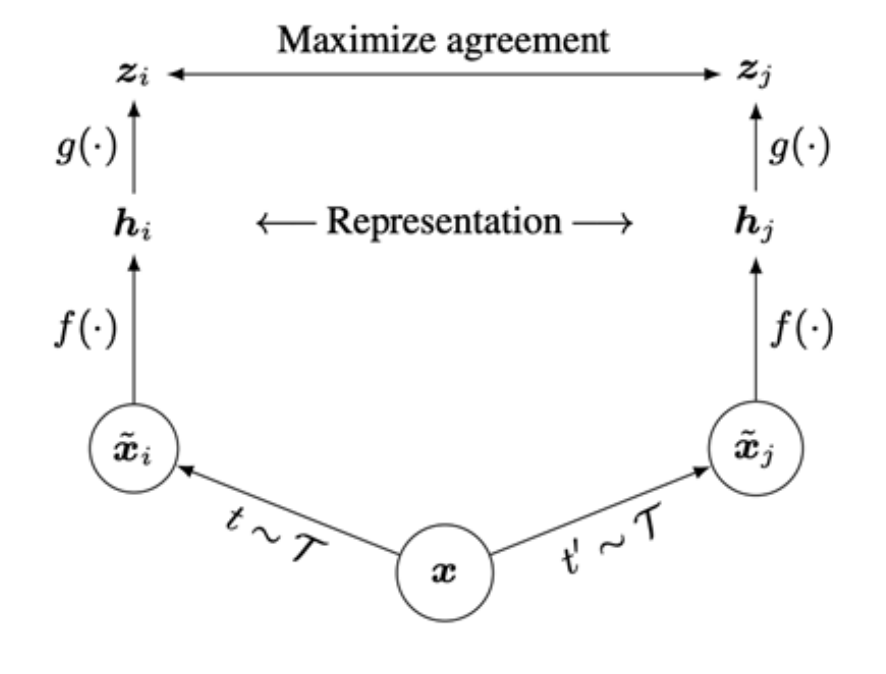
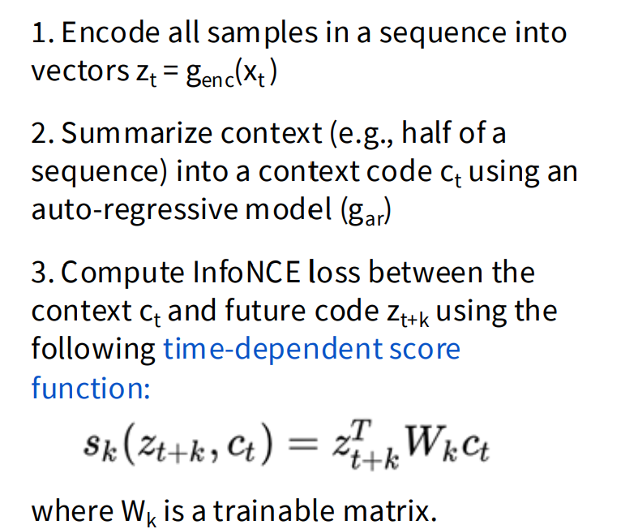
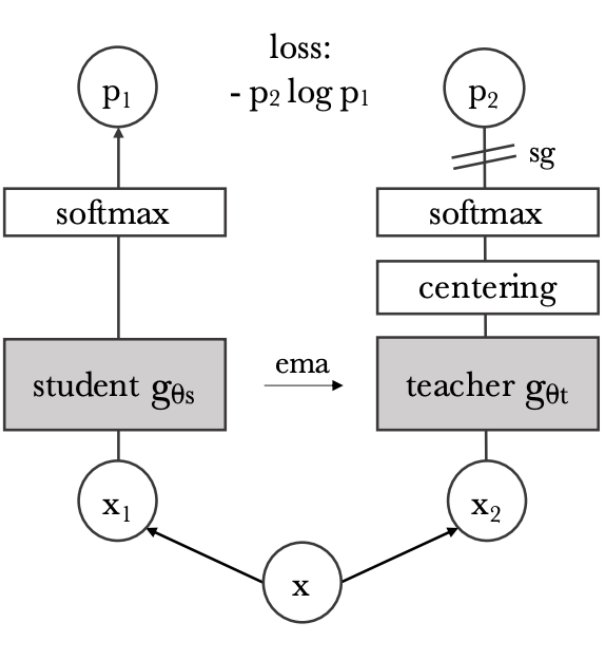
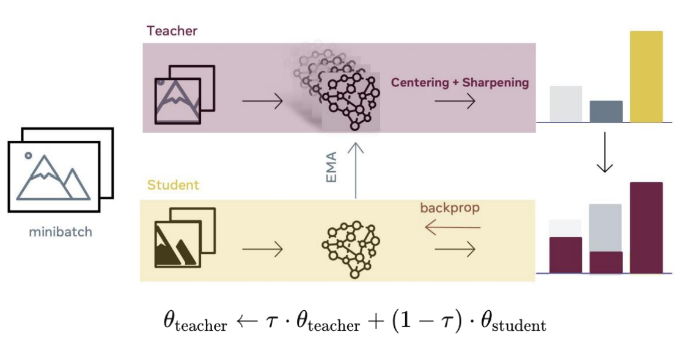

# Lecture 12

## Pretext tasks from image transformations 图像变换中的预设任务

- pretext tasks 是指基于数据本身的任务，本身不被监督 (Unsupervised)，没有做图像分类等分类标识
  - dataset with no labels
- Downstream Task 是下游任务，应用层面的，数据集不大但是已经被标识过了

**无监督学习**就是**没有对数据本身人为的打标签**，它的目的只是**发现并预测数据存在的结构规律**
-> 聚类 / 降维 等方法中使用

pretext tasks 有包含：
- predict rotations
- predict relative patch locations
- solving “jigsaw puzzles”
- predict missing pixels 图像修复
  - by reconstruction
  - by adversarial learning
- image coloring
  - Split-brain Autoencoder
    - cross-channel predictions，分块不同次用不同推理扫
- video coloring
  - 通过**参考帧**和时间向量的学习给**目标帧**上色

$$L(x)=L_{\text{recon}}(x)+L_{\text{adv}}(x)$$
$$L_{\text{recon}}=\left\|M\odot(x-\hat{x})\right\|_2^2$$

重建损失值只比较**可见区域的误差**，它要求尽量让相应预测像素接近原像素。

通常会把纹理、边缘“平均糊掉”

$$L_{\text{adv}}=\max_D\mathbb E[\log D(x)+\log(1-D(\hat{x}))])$$

这里 \(D\) 是判别器：
- 对真实图 \(x\)，它想让 \(D(x)\to1\)
- 对补全图 \(\hat{x}\)，它想让 \(D(\hat{x})\to0\)
- 而生成网络 \(F_\theta\) 会反过来学习骗过 \(D\)，让补全结果看起来像真实图

\(L_{\text{recon}}\) 管像素还原，\(L_{\text{adv}}\) 管图像真实性

### Masked Auto Encoders (MAE)

更大的图片遮挡比例情况下还原图片。

类似于ViT，但是endoder not using mask tokens and picking a high sampling ratio，意味着encoder端计算量更大（每token平均9次）

在decoder输入端会先把所有的Mask token补回来（初始同一套参数-shared_mask_tokens），结合位置编码向量与Attention，这样可以**精炼计算**

同时Decoder设计上实质不需要后训练，同时 independent of the encoder design, making it flexible.

- asymmetrical （非对称的）autoencoder design

### Linear Probing vs Full Fine-tuning 效果反馈

Linear probing 用已经完整的模型外接一层线性层输出结果；

Full Fine-tuning 则是后接若干层 further trained，可以反映实际情景下的potential

## Contrastive representation learning 对比学习

给定参考样本 \(x\) 和 \(N\) 个候选，模型要认出其中唯一真正与它对应的正样本 \(x^+\)。

几何直觉上，同一只猫的旋转、裁剪、遮挡版本都是正样本，要在特征空间里靠近；狗等无关图像是负样本，要推远。

这样编码器 \(f\) 被迫忽略旋转、裁剪等外观扰动，保留“这是同一只猫”的语义信息。

即

\(s(f(x),f(x^+)) \gg s(f(x),f(x^-))\) 

刻画方法（1个正样本和N-1个负样本）- InfoNCE Loss：

\(L=-\mathbb E_x\log
\frac{\exp(s(x,x^+))}
{\exp(s(x,x^+))+\sum_{j=1}^{N-1}\exp(s(x,x_j^-))}\)

显然有

\(I(f(x);f(x^+))\ge \log N-L\)

### SimCLR: A Simple Framework for Contrastive Learning

对一个 minibatch 中的每张原图 \(x_k\)，随机采样两次**数据增强**：
\[
\tilde x_{2k-1}=t(x_k),\qquad
\tilde x_{2k}=t'(x_k)
\]它们是同一原图的两个视图，因此构成正样本对；增强包括随机裁剪、颜色扰动、模糊等。

训练时希望模型认出：“这两个看起来不同的图，其实来自同一个实例”。

然后依次经过：
\[
h_i=f(\tilde x_i),\qquad z_i=g(h_i)
\]\(f\)：主编码器，产生表征 \(h\)
\(g\)：projection head，把 \(h\) 投影到专门用于对比损失的空间 \(z\)
相似度：余弦相似度 \(s(z_i,z_j)\)

若 batch 有 \(N\) 张原图，增强后有 \(2N\) 个视图。
以其中一个视图 \(i\) 为 anchor：
它的另一个增强视图 \(j\)：唯一正样本
batch 中其余 \(2N-2\) 个视图：负样本
自己 \(i\) 不参与比较
\[
\ell(i,j)=
-\log
\frac{\exp(s(z_i,z_j)/\tau)}
{\sum_{k\ne i}\exp(s(z_i,z_k)/\tau)}
\]\(\tau\) 是 temperature：越小，模型越强调最相似、最难区分的候选。整个 batch 会把每个视图都轮流作为 anchor，算双向损失再平均。也就是说，SimCLR 不需要人工标签，而是让模型在 batch 中找出“哪个视图和我同源”。

为什么要多一个 \(g\)：

对比损失直接约束的是 \(z=g(h)\)，但下游分类通常使用的是 \(h\)，训练结束会丢掉 \(g\)。
原因是：为了对增强不变，\(z\) 可能不得不丢弃颜色、局部纹理等信息；这些信息对某些下游任务仍然有用。让 \(g\) 承担“为对比任务而压缩和不变”的压力，能让 \(h\) 保留更丰富的表征。

- 增强策略很关键：它定义了什么变化应被忽略、什么语义应被保留。
- SimCLR 用同 batch 的样本作负样本，所以很依赖**大batch来获得足够多的负例**；代价是反向传播显存很大。
- 预训练后冻结 \(f\)，只训练线性分类器，或用少量标签微调，仍能有很好的 ImageNet 结果。
  - 讲义的实验正是在说明：它学到的不是只会做“配对题”的特征，而是可迁移的**视觉表示**。

### Momentum Contrastive Learning (MoCo)

- Keep a running **queue** of keys (negative samples).
  - 用**队列**计算Loss，每次把最老的出队，最新的入队
- Compute gradients and update the encoder **only through the queries**.
  - 叫法类似但并不是Transformer架构
- **Decouple** min-batch size with the number of keys.
  - 将batch大小和负样本**解绑**，使更便于提供大量负样本。
- encoder 权重通过momentum方式维护。

改进：MoCo v2保留这套“队列 + momentum encoder”，再吸收 SimCLR 的强数据增强和非线性 projection head。

- Non-linear projection head and strong data augmentation are crucial for contrastive learning.
- Decoupling mini-batch size withnegative sample size
- all with much smaller memory footprint!

### Contrastive Predictive Coding (CPC)

从Instance的到处理有时序序列的Sequence.

- Contrastive: **对照**正确和错误的序列
- Predictive: **预测**即将出现的序列
- Coding: 学习得到对下游任务有用的特征向量

可以用于序列性的**音频分离**，**图片部分预测**等。

### DINO: Self-Distillation with No Labels

对 teacher 和 student 的矩阵迭代。