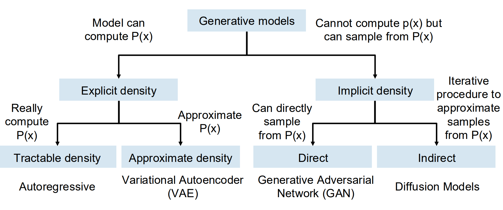
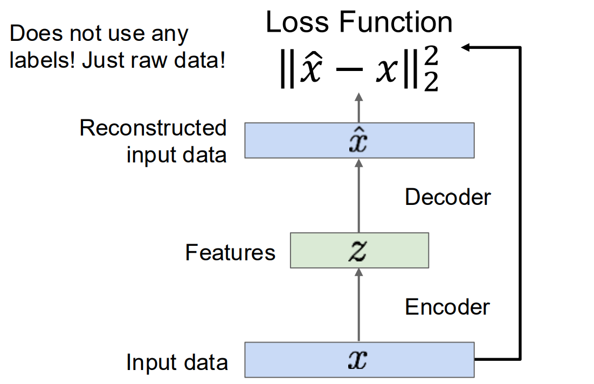
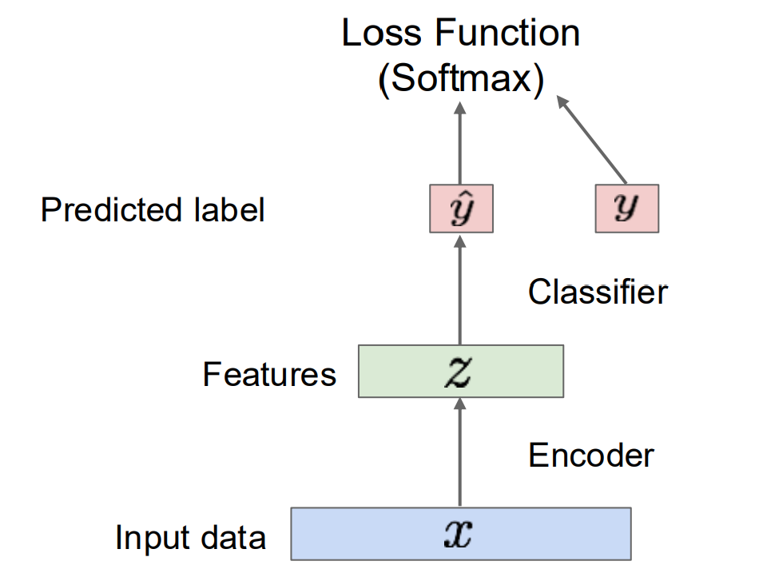
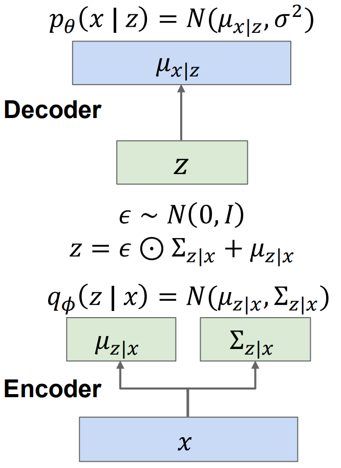

# Lecture 13

## Generative vs Discriminative Models

由贝叶斯公式：

- Discriminative Model: 学习先验概率 `p(y|x)`
  - 带标签特征学习（图片分类等）
- Generative Model: 学习事件概率 `p(x)`
  - 不带标签的特征学习：发现规律
- Conditional Generative Model: 学习后验概率 `p(x|y)`
  - 从特定 label 生成 data，从输入y到许多可能的输出x
  - 写文字：基于过去的Context信息从学习的P中逐个token取样生成

## 架构

本节介绍 Autoregressive 和 Variational Autoencoder(VAE)。

## Autoregressive Models

Model With RNN or Transformer

考虑输出x是一个序列，那么就相当于**对条件概率乘积式**做**最大似然估计**（取负对数交叉熵损失）。

- 训练时，x是已经观测到、固定不变的，**我们要调整的是参数W**

### Autoregressive Models of Images

- 问题：predict每一个子像素开销大
- 解决 (jumping ahead): 按照块序列分析，而不是按每个像素序列分析
- 理解上：语言模型通常不会逐个笔画生成文字，而是生成 token；图像模型也不必逐个颜色通道生成，而可以生成较大的“视觉 token”

## (Non-variational) Autoencoders

无label的情况下能提取出特征的encoder。

训练时框架包括：

训练后用于下游任务：

对于decoder的要求：通过特征要求z，从而生成新的图像

问题：生成新的特征z比较困难，autoencoder的特征提取和根据Input生成特征不是一回事情  
换言之，**普通 AE 没有解决生成全新图像时如何对有效 \(z\) 建模和采样的问题。**

Solution: What if we force all z to come from a known distribution?

## Variational Autoencoders (VAEs)

最大似然估计：

\(\max_\theta \log p_\theta(x)\)

但我们没有观察到生成这张图像的真实 \(z\)，所以必须将所有可能的 \(z\) 都考虑进去：

\(p_\theta(x)=\int p_\theta(x\mid z)p(z)\,dz\)

解释上：`z` 是一张图片的隐藏特征，是它使我们看到了图像 `x` 的全貌；但是 `z` 本身是高维连续变量，并没有办法直接计算其积分  
换言之encoder推断原因，而decoder生图。

即：

- Decoder 的目标是 \(p_\theta(x\mid z)\)，而encoder的目标是 \(p_\theta(z\mid x)\)
- 真正的目标是decoder，encoder只是训练使用的辅助，我们希望不借助原始图像自主生图。

贝叶斯公式\[p_\theta(z\mid x)=\frac{p_\theta(x\mid z)p(z)}{p_\theta(x)}\]

分母 \(p_\theta(x)\) 正是刚才无法计算的积分，因此真实后验 \(p_\theta(z\mid x)\) 也无法计算。

因此引入另一个网络\(q_\phi(z\mid x)\approx p_\theta(z\mid x)\)

这个是VAE Encoder所使用的网络。

我们采用的**先验假设**：z每个维度都服从**正态分布**。

所以，VAE 的 Encoder 输出一个正态分布的**期望和标准差参数**，并从中采样。

### ELBO

从贝叶斯公式推导得到

\(\log p_\theta(x)=\mathbb E_{q_\phi(z\mid x)}[\log p_\theta(x\mid z)]-D_{\mathrm{KL}}\left(q_\phi(z\mid x)\Vert p(z)\right)+D_{\mathrm{KL}}\left(q_\phi(z\mid x)\Vert p_\theta(z\mid x)\right)\)

其中最后一项大于等于0，因此

\(\log p_\theta(x)\geq\mathbb E_{q_\phi(z\mid x)}[\log p_\theta(x\mid z)]-D_{\mathrm{KL}}\left(q_\phi(z\mid x)\Vert p(z)\right)\)

即ELBO可以计算下限，记作\[\mathcal L_{\mathrm{VAE}}=\mathcal L_{\mathrm{recon}}+\mathcal L_{\mathrm{KL}}\]

**重建项 / Reconstruction Loss**希望标准差为0，期望unique，要求从 Encoder 得到 \(z\)，再送进 Decoder 后，应当能够还原输入 \(x\)。

- 最大化条件对数似然等价于最小化：\[\|x-\mu_{x\mid z}\|_2^2\] 根据数学方法可以推导。

**KL项 / Prior Loss**要求Encoder 为每个输入产生的 latent distribution 不要随意散落，要尽量接近标准正态先验。

- **KL 散度**（Kullback-Leibler Divergence），又称相对熵，是信息论与统计学中用于度量两个概率分布 P 和 Q 差异的指标。它量化了使用**基于分布 Q** 的近似模型来表示真实分布 P 时，所损失的信息量或引入的平均额外编码代价。

### 训练过程

z服从正态分布是我们所做的**先验假设**，其维数是**超参数**。

### 采样过程

采样过程非常简单，只需要用到decoder即可。

### 总结

在前面的Non-variational的情况下从x计算得到确定的z再复原得到x，却**没有规定**所有训练图像的z**应该如何分布**，没法保证除了训练输入图像之外的输入的**有效性**。；但是variational借助**使用正态分布的先验假设**构建了**服从正态分布**的z，同时引入KL项可以约束**结果受制约**，所以可以使**生成时**保证\(q_\phi(z\mid x)\approx p_\theta(z\mid x)\)。
