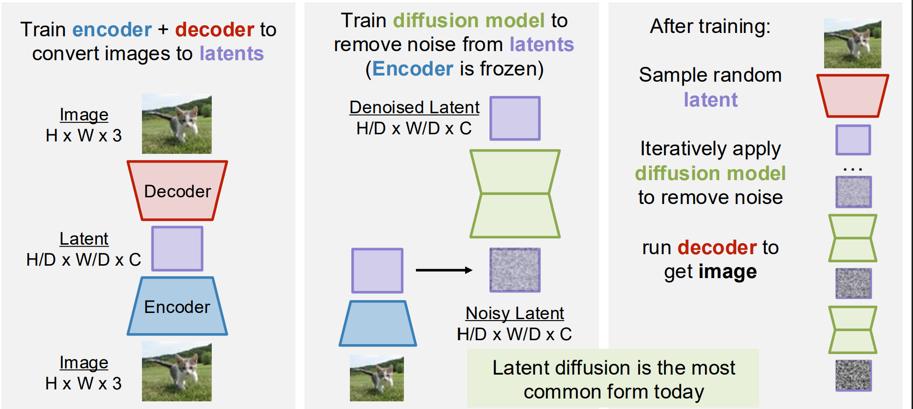
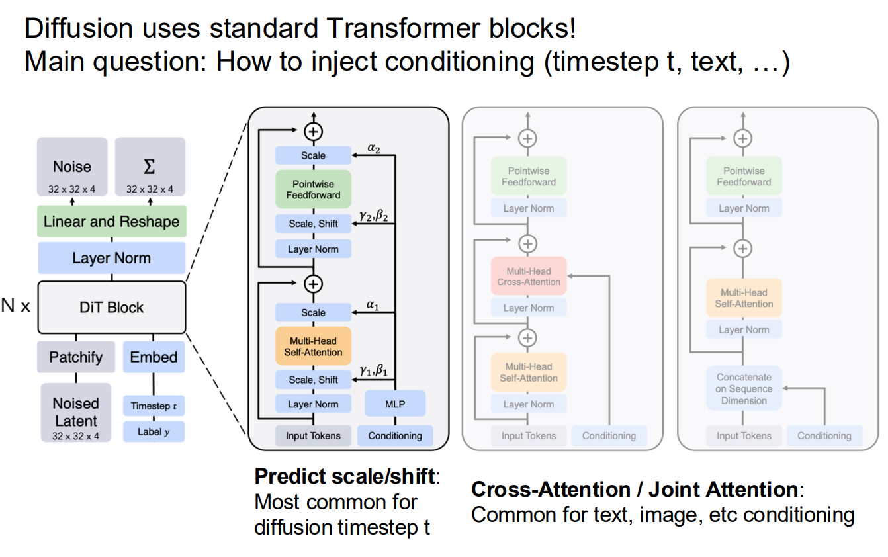
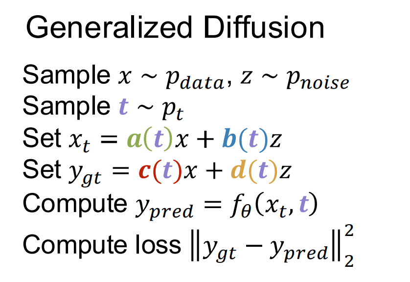

# Lecture 14

## Generative Adversarial Networks 生成对抗网络

它不要求对 `p(x)` 进行建模，但是允许从 \(x_i\sim p_{\text{data}}(x)\) 抽选样本数据。

引入**可以直接采样**的 `z` （一般服从标准正态分布），通过generator生成\(x_{\text{fake}}=G(z)\)。之后为了辨别生成图片画的**像不像**，引入判别器\(D(x)=P(x\text{ is true})\)

两边同时升级，最终希望：\[p_G=p_{\text{data}}\] 即重建图片**还原**原图片。

### minimax 目标

\[
\min_G\max_D V(G,D)
\]
\[
V(G,D)=
\mathbb E_{x\sim p_{\text{data}}}[\log D(x)]
+
\mathbb E_{z\sim p(z)}
[\log(1-D(G(z)))]
\]

- 判别器D希望最大值在 \(D(x)=1\)，\(D(G(z))=0\)，即可以**判别图片的真伪**。
- 生成器G希望 \(D(G(z))\to1\)，也就是让假图骗过判别器。

### 训练过程

- 固定 \(G\)，训练 \(D\) 分辨真假。
- 固定 \(D\)，训练 \(G\) 欺骗 \(D\)。
- 不断重复。
  - 判别器对 \(V\) 做梯度上升，而生成器对 \(V\) 做梯度下降，loss不一定稳定。

### Non-saturing loss

**问题**：开始时生成器容易**梯度消失**。

训练初期，生成器画得非常糟，判别器很容易发现；而

（假设最后一层是Sigmoid函数）那么 \(D(G(z))\approx0\) 时由于函数相关性质，梯度也接近 0。

**解决**：实际训练时生成器最小化：\(L_G^{\text{NS}}=-\mathbb E_z[\log D(G(z))]\)，**对D的训练不改变**。

这样并不改变对G的期待，但是可以给予更大的早期梯度。

### 理论理解

固定生成分布 \(p_G\)，对每个位置 \(x\)，判别器需要最大化：
\[
p_{\text{data}}(x)\log D(x)
+
p_G(x)\log(1-D(x))
\]求导并令其为 0，可得到最优判别器：
\[
D_G^*(x)=
\frac{p_{\text{data}}(x)}
{p_{\text{data}}(x)+p_G(x)}
\]

把最优判别器代回目标，可以得到：
\[V(G,D_G^*)=-\log4+2\,\mathrm{JS}\left(p_{\text{data}}\Vert p_G\right)\]

JS divergence 永远非负，而且只有两个分布完全相同时等于 0。因此全局最优点为：\[  
p_G=p_{\text{data}}\]

此时：

\[D^*(x)=\frac12\]

意义是判别器**无法识别真假**，但理论不等于实际训练一定收敛。

- 神经网络容量有限，未必能表示理论上的最优 \(G\) 和 \(D\)。
- 数据有限，只能看到经验分布。
- 梯度交替更新不保证到达博弈均衡。
- 判别器过强可能造成生成器梯度太弱。
- 生成器可能只生成少数几类结果，即 mode collapse。

### 实际架构

- DCGAN 的生成器与判别器都主要使用**卷积网络**
  - 它的重要意义是证明 GAN 不仅能处理玩具数据，也能在真实图像上生成有意义的结果。
- StyleGAN 不只是把 \(z\) 从网络开头输入一次，而是将潜变量变成**不同层级的 style**，再注入生成器的多个层。
  - \(\operatorname{AdaIN}(x,w,b)_i=w_i\frac{x_i-\mu(x)}{\sigma(x)}+b_i\)

### 潜空间插值

\(z_t=t z_0+(1-t)z_1\) 再生成 \(x_t=G(z_t)\)

当 `t` 连续变化时，图像也可以平滑变化。这说明生成器学到的不是“背诵训练图片”，而是一个**具有连续结构的图像流形**。

## Diffusion Models

考虑（默认用标准正态分布）用噪声分布生成 `z`，设置noise levels `t` 控制噪声化的程度，从原始数据 `x` 得到噪声处理过的 `x_t`

再**训练一个神经网络**，用来通过 \(f_\theta(x_t, t)\)，从噪点还原图片。

### Rectified Flow

训练过程：

```Python
for x in dataset:
    z = torch.randn_like(x)
    t = random.uniform(0, 1)
    xt = (1-t)*x + t*z
    v = model(xt, t)
    loss = (z-x-v).square().sum()
```

采样过程：

设置步数 `T`，以 `1/T` 为步长**迭代t**，并以 `v_t/T` 为步长迭代并得到最终的x

```Python
sample = torch.randn(x_shape)
for t in torch.linspace(1, 0, num_steps):
    v = model(sample, t)
    sample = sample - v/num_steps

```

### Conditional Rectified Flow

通过条件约束来**引导**x落在某个范围内。

比如通过文字语义的向量嵌入。

#### Classifier-Free Guidance (CFG)

```Python
for (x, y) in dataset:
    z = torch.randn_like(x)
    t = random.uniform(0, 1)
    xt = (1-t)*x + t*z
    if random.random() < 0.5: y = y_null # 有0.5的概率使x向条件y偏移
    v = model(xt, y, t)
    loss = (z-x-v).square().sum()
```

```Python
sample = torch.randn(x_shape)
for t in torch.linspace(1, 0, num_steps):
    vy = model(sample, y, t)
    v0 = model(sample, y_null, t)
    # Doubles the cost of sampling
    v = (1+w) * vy - w*v0 # points more toward p(x|y)
    sample = sample - v/num_steps
```

Classifier-Free 是因为我们不需要训练模型计算分类 `p(y|x)`，以及根据此决定梯度更新方向

### Optimal Prediction

理论上，能得到`x_t` 的 `(x, z)` 不止有一对；**需要对结果取平均得到最优预测**

\(v^*(x_t,t,y)=\mathbb E[z-x\mid x_t,t,y]=\frac{x_t-\mathbb E[x\mid x_t,t,y]}{t}\)

- `t=1` 时 `x_t` 在终点位置，只需要求 `p_data` 平均
- `t=0` 时 `x_t` 在起点位置，只需要求 `p_noise` 平均
- 对于中间部分难求的Solution: 对 `t` Use a non-uniform noise schedule
  - 原因：后验分布可能复杂、多峰，而且会随 \(x_t\) 剧烈变化，因此最难学习。
  - 非均匀分布（比如sigmoid函数）可以使训练更经常采到**中等噪声**，把训练资源放在**最复杂最影响生成质量**的区域
  - 再比如，For high-res data, often shift to higher noise to account for pixel correlations

### Latent Diffusion Models (LDMs)



结合VAE训练encoder+decoder，结合GAN训练逼真性（解决输出模糊的问题）

*Modern LDM pipelines use VAE + GAN + diffusion!*

### Diffusion Transformers



进一步应用于 Text to Image / Videos 等。

通过**蒸馏** (Distillation) 减少重复跑diffusion models的次数步数。

### Generalized Diffusion 广义Diffusion



选择这些函数的**依据**是**数学形式**。

#### Denoising Diffusion Probabilistic Models (DDPM)

| 对比项 | DDPM | Rectified Flow |
|---|---|---|
| 中间状态 | \(x_t=\sqrt{\bar\alpha_t}x_0+\sqrt{1-\bar\alpha_t}\epsilon\) | \(x_t=(1-t)x+t z\) |
| 路径 | 由噪声 schedule 决定的曲线路径 | 数据与噪声之间的直线路径 |
| 时间 | 通常是离散的 \(t=0,\ldots,T-1\) | 连续的 \(t\in[0,1]\) |
| 模型预测 | 噪声 \(\epsilon\) 或原图 \(x_0\) | 速度 \(v=z-x\) |
| 训练损失 | \(\|\epsilon-\epsilon_\theta(x_t,t)\|^2\) 等 | \(\|z-x-v_\theta(x_t,t)\|^2\) |
| 生成方式 | 逐步采样反向高斯分布，通常带随机性 | 从噪声出发，反向求解 ODE，通常是确定性的 |

\(x_t=a(t)x_0+b(t)\epsilon\) 是**统一形式**。

它们的**核心思想相同**：把数据逐渐变成噪声，再学习反向过程。

DDPM **训练过程**：
干净图片 x₀  
- 随机选择 t  
- 采样真实噪声 ε  
- 一步生成 xₜ  
- U-Net 预测 ε 或 x₀  
- 计算 MSE  
- 更新模型  

**推理过程**：

纯噪声 xT  
- U-Net 预测 ε 或 x₀  
- 估计干净图片 x̂₀  
- 计算后验均值和方差
  - \(q(x_{t-1}\mid x_t,x_0)=\mathcal N(\tilde\mu_t,\tilde\beta_t I)\)  
- 采样 xₜ₋₁  
- 重复直到 t=0  
- 反归一化得到图片  

原理与Rectified Flow有类似之处。