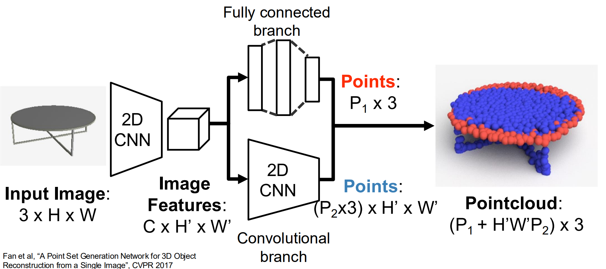
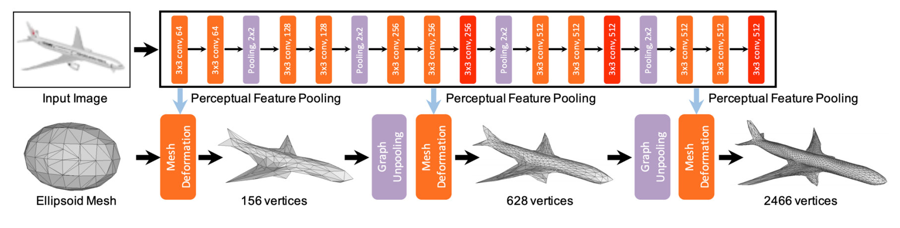
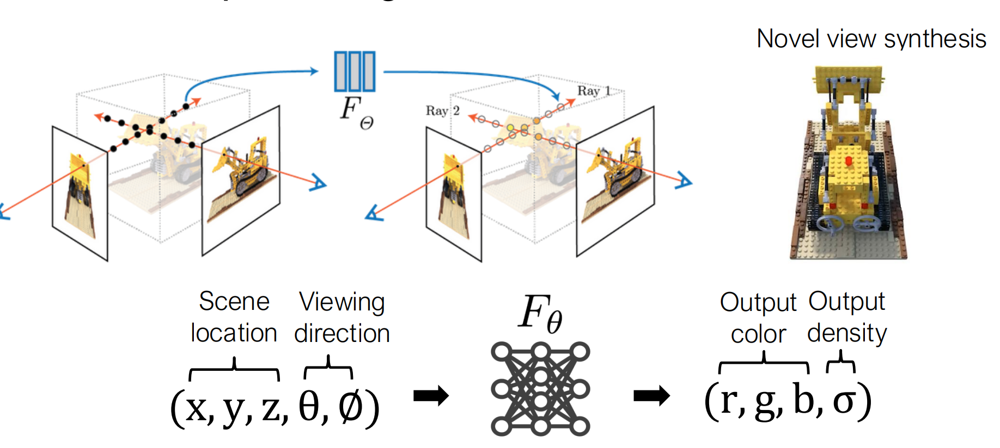

# Leture 15

## Multi-View CNN

- Multi-View CNN: 把图片不同视角喂给CNN
  - 正常CNN之后，汇总不同视角再用第二层CNN算SoftMax

## 3D Shape Representations

### Depth Map

- RGB image + Depth image = RGB-D Image (2.5D)
- 可以被一些3D传感器记录；同理可以通过FC等来训练其预测Depth
- 问题是使用此方法会有**尺度/深度歧义**
  - 比如一个小而近的物体可能和一个大而远的物体图像上相同
  - 解决：学习场景的**相对几何结构**。

令

\[d_i=\log y_i-\log y_i^*\]

其中 \(y_i\) 是预测深度，\(y_i^*\) 是真实深度。那么 loss 可以写成：

\[D(y,y^*)=\frac1n\sum_i d_i^2-\left(\frac1n\sum_i d_i\right)^2=\operatorname{Var}(d_i)\]

计算方差意味着我们保证计算相对几何结构的同时**允许整体差一个倍数**

- Surface Normals 描绘图片上各个点对应表面的**法向量**，使用余弦夹角计算loss

### Voxel Grid

用3D网格方块来建模存放。  
问题：

- 需要用高分辨率图片来得到好的特征
- 把图片扩展到高分辨率困难
- 存储空间巨大

解决：Scaling Voxels: Oct-Trees

- 先放大方块再放小方块

### Pointcloud

Represent shape as a set of P points in 3D space.

- 优点：不需要很多点就可以很好描绘形状结构
- 缺点：不显式表示外形形状，需要后续处理

#### 架构

生成Pointcloud Output

- 图中蓝色点描述主体
  - CNN要求利用连续性，且保留特征H' W'尺寸，换言之每个特征都要生成P2个点
- 红色点描述细节部分（比较自由）
- 两者取**并集**

Processing Pointcloud + RGB = 结合了PointNet和CNN方法一起分析

#### Loss 函数计算

把所有点分成sets，然后 Chamfer distance is the sum of L2 distance to each point’s **nearest neighbor in the other set**

### Mesh

Triangle Mesh Represent a 3D shape as a set of triangles.  
用三角形来描绘3D形状，好处在于

- 是计算机图形学中常见的表达形式
- 显式描述3D图形
- 表达平整面的开销低，整体效果好
- 可以附加信息
  - RGB colors, texture coordinates, normal vectors

缺点是神经网络不好处理。

架构使用了

- Iterative Refinement
- Graph Convolution
- Vertex Aligned-Features
- Chamfer Loss Function

达到目标面数。

#### Mesh R-CNN

将图片转换成Triangle Mesh来识别物体。

在上面图中，Mesh Deformation 变形操作非常有用，但是其拓扑性质需要一个初始的确定

Mesh R-CNN给出的解决方法是Use voxel predictions to create initial mesh prediction!

### Implicit Surface

- 学习一个函数，分类某个点处于几何表面内或外（取值0-1，轮廓处为1/2）
  - 比如拟合数学解析函数
- 利用布尔运算取 implicit geometry 描绘复杂图形
- 架构有DeepSDF / NERF 等。
  - \(\text{DeepSDF}: (x,y,z)\rightarrow\text{到表面的有符号距离}\)

#### NeRF

用一个神经网络把整个三维场景“存”成连续函数，然后从任意新视角渲染照片。

\(F_\theta:(x,y,z,\theta,\phi)\rightarrow(r,g,b,\sigma)\)

其中θ,ϕ是提供的两个视角，σ是密度（描述射线穿透的能力，值小更容易穿过）

假设要渲染某个像素，NeRF 会从相机中心穿过这个像素发射一条射线：
\[\mathbf r(t)=\mathbf o+t\mathbf d\]
然后在射线上采样很多点：
\[\mathbf x_1,\mathbf x_2,\ldots,\mathbf x_N
\]每个点都送入 MLP：
\[F_\theta(\mathbf x_i,\mathbf d)\rightarrow(\mathbf c_i,\sigma_i)\]
得到每个采样点的颜色和密度，最后按照从近到远进行体渲染：
\[\hat C(\mathbf r)=\sum_i T_i\alpha_i\mathbf c_i\]
其中
\[\alpha_i=1-e^{-\sigma_i\delta_i}\]
表示该点的不透明程度，而 \(T_i\) 表示光线在到达该点之前还剩多少能量。

问题：速度太慢。

#### Gaussian Splatting

Blend a discrete set of Gaussians along the ray.

速度快，并且可以实时渲染。
