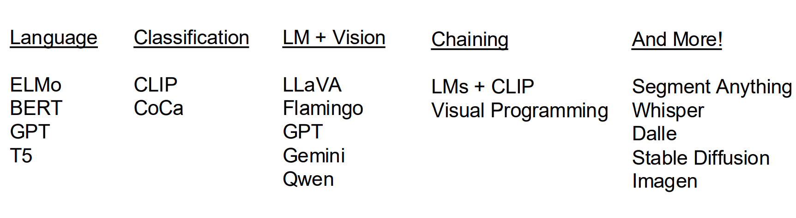
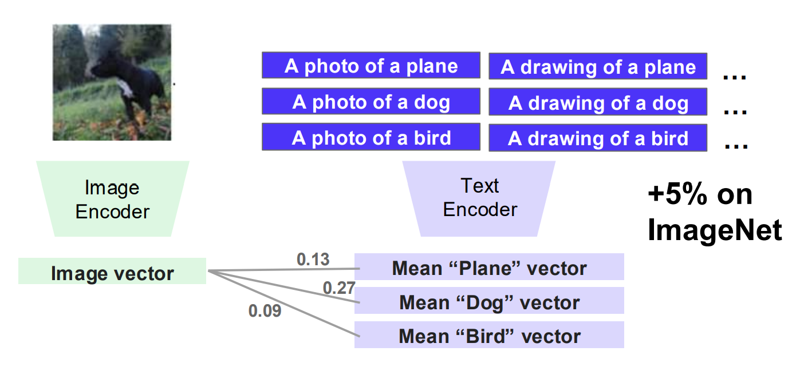
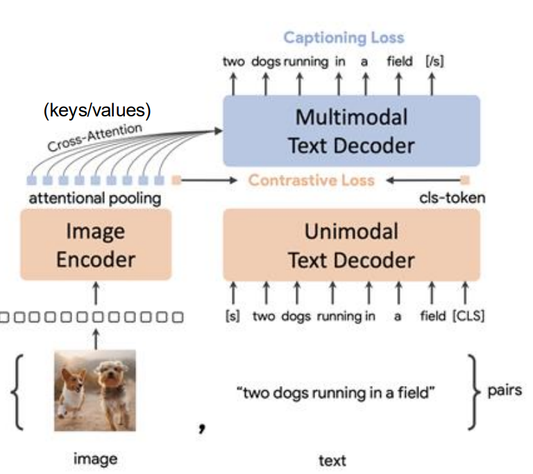
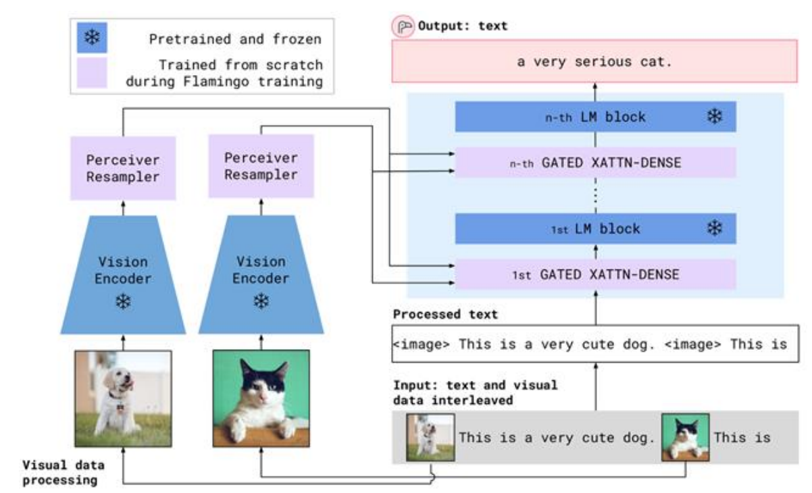

# Lecture 16

## Foundation models

是指Pre-train one model that acts as the foundation for many different tasks，即预训练一个模型，将它用于不同任务。

从之前的 Self-Supervised Learning 出发思考如何联合Vision和自然语言。

分类。

## Classification Models

### CLIP 架构

对于训练而言，我们只需要能够文字和图片**匹配起来**即可，不需要考虑具体含义。

那么从SimCLR想法出发，我们有 Image Encoder 和 Text Encoder。正面样本由匹配的文字给出。

\(\mathcal L_{I\rightarrow T}=\sum_{i=1}^{n}-\log\frac{e^{\langle u_i,v_i\rangle}}{\sum_{j=1}^{n}e^{\langle u_i,v_j\rangle}}\)

\(\mathcal L_{T\rightarrow I}=\sum_{i=1}^{n}-\log\frac{e^{\langle u_i,v_i\rangle}}{\sum_{j=1}^{n}e^{\langle u_j,v_i\rangle}}\)

这两部分构成Loss函数。

#### 使用方法

- Pretrain a network on a pretext task that doesn’t require supervision
  - 先无监督学习训练一个网络
- Transfer encoder to downstream tasks via linear classifiers
  - 把它用于下游任务

#### 零样本使用

在语言模型中，下游任务并没有给上游提供训练样本。

- 上游训练的是**文本预测**，对于Chat（下游）中 `The movie review "I hated the movie" is ____` 而言：
- 它并没有训练过情感相关内容，但是可以用上游能力补全下一token是 **`negative`**

类似地也可以将其思想运用到CLIP中。

此外，CLIP模型参数相当于Transformer级别，也可以爬取互联网上文字+图片来扩大训练量。

### SigLIP

作为一种变体，它使用Sigmoid函数而不是Softmax。

对于Sigmoid Loss而言，\(\mathcal L=\sum_{i,j}\mathcal L_{ij}\) 意味着它的**每一项都是独立的**，不必整个批一起处理，可以减小显存压力。

### CoCa

CLIP 只要求了计算 Contrastive Loss，即只要求特征向量相似。

而 CoCa 则引进了 Captioning Loss，可以满足**看图说话**的能力训练要求。

- Cross Attention中：
  - 文本特征充当 Query
  - 图像各区域的特征充当 Key 和 Value
- Unimodal 表示这一部分只处理文本，还没有读取图片。
  - 它通过 causal self-attention 理解前面的文本，并产生一个**全局文本表示**。
  - 图中的 cls-token 就用来**参与 Contrastive Loss**，与图片的全局向量比较。
- Multimodal 进入多模态解码器。
  - 它不仅看前面的文字，还通过 Cross-Attention **读取图片特征**
  - 通过**看图说话**得到 Captioning
- 图中的 attentional pooling 有两种用途：
  - 汇总成一个**全局图像向量**，用于 Contrastive Loss。
  - 保留多个包含细节的视觉表示（视觉Token的生成），作为多模态解码器 Cross-Attention 的 Key/Value。

缺点：

- Rely too heavily on **batch size** to learn concepts
  - Animal ~ Dog ~ 品种 过程对Batch size要求越来越高
  - 解决：Hard Negative Fine-Tuning，错的强制判错
  - 问题是也很难找到对的
- Image-level captions are insufficient supervision
- You can’t know everything in a single 5B dataset

## LM + Vision Models

### LLaVA

把图片转换成一串视觉 token，像文本 token 一样送入 LLM。

组成上由

- 视觉编码器：预训练 CLIP，提取图像 patch 特征。
- LLM：例如 LLaMA，负责自回归生成文本。
- Linear Projector：把 CLIP 特征映射到 LLM 的词向量空间

组成。

- 通常使用 CLIP 倒数第二层的 patch tokens
- 用一个简单的投影层，把 CLIP 的视觉 token 直接“翻译”成 LLM 能理解的 token。

### Flamingo

Flamingo 不只是把视觉 token 放在文本 token 前面，而是在冻结的语言模型中插入 Cross-Attention。

预训练并冻结

- Vision Encoder
- 原有 Language Model blocks

新训练的两个部分是

- Perceiver Resampler
  - 把数量不固定的图像特征压缩成固定数量的**视觉 token**。
- Gated Cross-Attention
  - 插入语言模型各层，使文本在**生成过程中能够查询图像信息**。
  - Gated 表示模型可以控制每层应该使用多少视觉信息，减少新增视觉模块对原语言能力的破坏。

它适合 多图片输入 / 视频帧输入 / 图文交错上下文 / 多模态 in-context learning

### Qwen3-VL

Open Weight 可以下载权重并在本地运行。但是训练方法等未必公开，也存在有**开源模型蒸馏闭源模型**的做法。

可以看作现代强化版 LLaVA：支持动态分辨率、视频时间、多层视觉特征和更长上下文。

### Molmo 与 PixMo

不仅公开权重，还公开：Weights Data Code Evaluations。

Molmo/PixMo 强调完整开放和高质量人工数据，说明多模态训练不只是“数据越多越好”，数据的细致程度与意图同样重要。

## Chaining

有些概念可能模型训练时完全没见过。

Solution: chaining
1. Get an LLM to generate a description.
2. Classify using the description

- CuPL (CUstomized Prompts via Language models)
- VisProg (visual programming) 通过图文提示词生成程序脚本处理具体任务。
