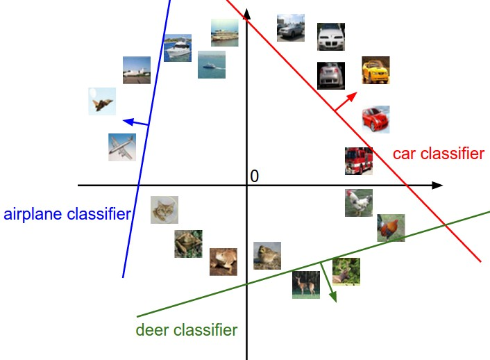

# Lecture 2

## kNN k-Nearest Neighbors

思想方法：将Image抽象成向量，去比较和待识别图片向量间的**距离**

* L1-Distance 曼哈顿距离
* L2-Distance 欧几里得距离

### 向量怎么得到？

在课程本部分强调的是**逐个像素比较**。

实际上（涉及深度学习）：

* 将训练图像先进行**预处理**，裁切成相同大小，并消除曝光度等影响
* 再通过特殊算法进行**特征提取**，抽象成包含**语义信息**的高维向量
  * 传统上使用**手工提取**特征信息
  * 现代上使用**卷积神经网络** (CNN)

### k的调参

k过小容易过拟合，k过大容易欠拟合。

> Intuitively higher values of k have a smoothing effect that makes the classifier more resistant to outliers.

### 超参数 & 验证集

包括k / 距离方法的计算选取等，它们在AI领域设计经常用到，需要**调参**。

> These choices are called hyperparameters and they come up very often in the design of many Machine Learning algorithms that learn from data.

数据一般分为三类：training / validation / test

validation相当于可以横向对比不同k的拟合情况以确定k等**超参数**取值，test set不用于调参。

#### Cross-Validation

将数据分为若干份，不同数据在不同学习中轮流作为validation。缺点是计算开销大。一般倾向于使用 50 - 90%的数据用来训练，其他用来做validation。

### 优缺点

> This is backwards, since in practice we often care about the test time efficiency much more than the efficiency at training time.

缺点是计算开销昂贵。改进在Approximate Nearest Neighbor (ANN)。

## Linear Classification

逐个像素比较的缺点很明显。我们采用**线性分类器**的方法。

本质是矩阵乘法。

$$scores = Wx + b$$

- `x` 是展平后的图像向量
- `W` 是权重矩阵
- `b` 是偏置
- 输出是每个类别的 score

W和b都是**普通参数**。

普通参数可以在训练过程中**由机器**自动调整，超参数只能人手动调整。

每一行 `W[j]` 可以看成第 `j` 类的分类模板，与输入图像做点积后得到该类分数。

从代数 / 几何 / 视觉视角可以阐释。

相当于在高维的空间中做类似展开：



b的偏置使它不过原点。

由于实际上相应特征**线性不可分**，因此这种描述方式表达能力有限。

### 图像数据的preprocessing

> In particular, it is important to **center your data** by subtracting the **mean** from every feature.
> ... where the pixels range from approximately [-127 … 127]. Further common preprocessing is to scale each input feature so that its values range from [-1, 1].

## Loss Function

衡量当前模型参数在训练数据上的预测有多坏。

### Multiclass SVM loss

$$L_i = \sum_{j \neq y_i} \max(0, w_j^T x_i - w_{y_i}^T x_i + \Delta)$$

简单而言是希望**目标class上的得分**能显著高于其他class（delta）。

问题：W的选取不唯一，存在W使得loss function = 0的话，增大W依然让loss function = 0。需要偏好**更小更简单**的权重设置。

* *为什么？*
* 如果W的权重比较大，会使得数据过于敏感

解决方法：**正则化**（regularization）

$$L = \frac{1}{N} \sum_i \sum_{j \neq y_i} \left[ \max(0, f(x_i; W)_j - f(x_i; W)_{y_i} + \Delta) \right] + \lambda \sum_k \sum_l W_{k,l}^2$$

* N是**训练集总量**
* λ是**超参数**，具体由cross validation 所确定
  * λ 控制正则化强度，也就是限制权重 W 不要长得太大。它决定模型是更贴合训练数据，还是更偏向简单、泛化更好的解。
* delta可以设成1.0，因为本质上可以被 W 的缩放抵消。
* max(0, -) 涉及到*hinge loss*（loss曲线在x = delta处有个折角），也有加平方的形式在特殊场合用。

注意到左边规范化了Data Loss，右边项用**L2 正则化**。

补充 Binary SVM: 相当于多分类特殊情况，在高维空间中找一个超平面，把相关特征分为两部分。

### Softmax classifier

它把Scores转换成指数意义上的概率分布。

```text
P(y = j | x) = exp(s_j) / sum_k exp(s_k)
```

然后使用 cross-entropy loss：

```text
L_i = -log(P(correct class | x_i))
```

实际意义是从 hinge loss 换成 cross-entropy loss，即 `Li = -log(正确类别的预测概率)`

交叉熵越小，说明预测分布越接近真实分布。所以 Softmax classifier 的训练目标是让**预测概率分布尽量接近真实标签分布**。

实际计算可以分子分母乘以一个常数项C，即给所有 scores 减去最大 score，避免 exp 溢出，保证计算精度。
