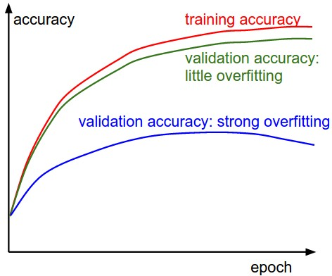

# Lecture 3

## 梯度下降 gradient descent

在SVM中我们分析凸函数做优化，实际情况会比简单凸函数更复杂，但我们依然使用凸函数分析。

凸函数可能未必处处可导，因此涉及到次导数 / 次梯度概念。

### 优化方法对比

* 随机权重矩阵W：优化效率低，计算开销大
* 随机W，调整系数：略有提升，开销依然大
* 跟随梯度

### 计算梯度

* 数值方法计算：简单易实现，效率低（维数高的情况下求偏导计算量过大）
* 解析方法计算：**直接对Loss函数求偏导**

$$L_i = \sum_{j \neq y_i} \max(0, w_j^T x_i - w_{y_i}^T x_i + \Delta)$$

max函数对 `w_y_i` 求偏导，如果它非正那 = 0求偏导仍等于0，如果是正的，那么值为它本身乘以 x_i，求偏导为 x_i.

相当于

$$\nabla_{w_{y_i}} L_i = - \left( \sum_{j \neq y_i} \mathbb{1}(w_j^T x_i - w_{y_i}^T x_i + \Delta > 0) \right) x_i$$

换言之 `gradient wrt w_yi = - count * x_i`，以及 `gradient wrt w_j = x_i`，结果上依然得到一个大的矩阵。

从而在实际计算的时候减去这个负数，将Loss Function向更小的方向推。

```python
while True:
  data_batch = sample_training_data(data, 256) # sample 256 examples
  weights_grad = evaluate_gradient(loss_fun, data_batch, weights)
  weights += - step_size * weights_grad # perform parameter update
```

### 学习率

决定执行函数改变的**步长**，学习率过大可能会导致精度下降。

### batch size 和样本量

* Batch Gradient Descent：每次用全部训练样本计算梯度，方向稳定，但每步成本高
* Stochastic Gradient Descent（SGD）：每次用一个样本估计梯度，更新频繁但噪声大
* Mini-batch SGD：每次用一小批样本估计梯度，是深度学习中最常用的做法，许多语境下的 SGD 指的是 Mini-batch SGD

batch size一般设置为2的整数次幂，有利于硬件优化。

对于mini-batch中的多个样本，通常把每个样本的loss / 梯度**取平均**，得到这一步的更新方向。

### SGD过程中遇到的问题与优化算法

* 处理学习曲线导数**陡峭振荡**的问题，以及在平缓处推进缓慢的问题
* 处理**鞍点**等引发的问题
* 过程可能会被**小噪声**干扰

解决：

* 给予一个“动量”（Momentum）/ 惯性以迭代， `vx = rho * vx + dx`，`rho` 可设置为0.9或0.99。
* RMSProp等方法（后面章节会详细介绍）

## 事先准备：设置好数据和计算模型

### 数据预处理

一些方法形式：

* 平均值归零
* 常规化，使得在各个维度上的值接近相同
* PCA and Whitening：
  * 先**去中心化**
  * 再**计算协方差**，并用SVD**取奇异值和特征方向**
  * 再根据各个方向上的结果方差**降维处理**，舍去方差细小的次要维度
  * 最后**白化**，把旋转并降维后的数据除以特征值的平方根（标准差），强行把所有维度的方差都缩放成1

注意需要**仅计算**训练数据样本，不把验证 / 测试数据纳入。

### 权重参数初值

* 不应该全部设置为0：失去了不对称性
* 使用较小的随机数开始
  * 并非较小的数值就一定效果更好。例如，权重非常小的神经网络层在反向传播过程中会计算出非常小的梯度
* 校准方差为1，除以 `sqrt(n)`
  * 相关研究说方差为 `2.0 / n` 效果更好
* 稀疏初始化，设初值为0，神经元仅部分链接打破对称性
* 初始化偏置，将初值设置offset，但对性能未必是提升
* 批量归一化

In practice 采用 `w = np.random.randn(n) * sqrt(2.0/n)`。

## 损失函数

### 正则化损失 Regularization Loss

* L2正则化：加入 `1/2λw^2` 项，求导后得到关于w的一次项，使得惩罚峰值较高的权重向量，倾向于使用较为分散的权重向量
* L1正则化：加入 `|w|` 项，能得到接近0的结果，不受噪点影响
  * 性能上L2正则化更高。
* 最大范数约束：钳制每个神经元的权重向量大小。
  * 优势：限制住了上限，保证学习率过高条件下网络不爆炸
* Dropout: 仅以一定的概率 p（超参数）保持神经元处于激活状态，否则将其设置为零
  * 噪声可以通过 Dropout 或 多次采样取平均 等方式进行**边缘化**。
* 必要时**正则化偏差项** `b`。
* 逐层正则化（不常见）

```python
def predict(X):
  # ensembled forward pass
  H1 = np.maximum(0, np.dot(W1, X) + b1) * p # NOTE: scale the activations
  H2 = np.maximum(0, np.dot(W2, H1) + b2) * p # NOTE: scale the activations
  out = np.dot(W3, H2) + b3
```

In practice 采用 L2正则化 + cross validation + dropout (p = 0.5)。

### 数据损失 Data Loss

**之前提到**过 SVM / 平方化hinge loss / Softmax与交叉熵损失

问题：

* Softmax 当类别多时计算开销大。
  * 解决：树状分层 Softmax
* 标签分类可能涉及到多元非互斥的结果。
  * 解决1：维护 `y_ij` 的扩展，即满足 `y_i` 下 j 标签是否存在
  * Loss函数大于0标明存在，小于0标明不存在，绝对值小于阈值触发Loss函数累积
  * 解决2：为每一个每个属性独立训练一个逻辑回归分类器，判断**是否属于该类别**
    * 统合Sigmoid函数和损失函数：
    * $P(y=1 \mid x; w, b) = \frac{1}{1 + e^{-(w^Tx + b)}} = \sigma(w^Tx + b)$
    * $L_i = -\sum_j y_{ij} \log(\sigma(f_j)) + (1 - y_{ij}) \log(1 - \sigma(f_j))$
    * 求导得到 $\frac{\partial L_i}{\partial f_j} = \sigma(f_j) - y_{ij}$

### 回归 Regression

**回归**方法用来**预测**连续的具体数值，比如预测**损失**。

可以使用 L1 / L2 范数回归方法。

对于L2方法而言，平方量级上升意味着对离群噪点更敏感。  
作者建议，当你遇到回归问题时，首先想想能不能把它**离散化（分桶）**，强行变成一个分类问题。

* **结构化预测**是指需要输出一个复杂的图 / 树等情况，暂不讨论。

## 检查手段

### 梯度检查

目的是**检查**解析梯度和数值梯度区别，防止解析梯度代码实现时错误。

测试时会先用**小样本量**跑一遍梯度检查，保证在一定精度范围内。

* 使用 `(f(x+h)−f(x−h))/2h` 形式
* 使用**相对误差**
* 使用双精度浮点数检查
* 保证浮点数误差在一定范围内
* 追溯不可微的**拐点**
* 用少量数据
* 控制好差值h，比如 `1e-4` 或 `1e-6`
* 检查该保证在全局上有效
* 不让正则化处理影响过大掩盖数据
* 不使用dropout / 增强
* 只检查一部分维度

### 学习前检查

检查学习函数的工作性能，以及可以先过拟合一小部分样本以初始化。

### 学习中期

#### 图线分析

Loss-Epoch 曲线：


摆动幅度和**单批处理数据量大小**有关。



#### 其他参数方法：

* 观察Update情况相对于原数据的量级（一般在 `1e-3` 数量级好一点）
* 可以通过前期学习时激活函数是否饱和等，来验证**初始化**做的好不好
* 视觉上第一层神经网络的噪点特点特征应该是**比较干净**

## 参数更新方法

### 改变步长

```python

# Vanilla update

x += - learning_rate * dx

# Momentum update

v = mu * v - learning_rate * dx # integrate velocity
x += v # integrate position
```

考虑到**动量**的优化。

```python
x_ahead = x + mu * v

# evaluate dx_ahead (the gradient at x_ahead instead of at x)

v = mu * v - learning_rate * dx_ahead
x += v
```

简单的变种。

### 随时间削弱学习率

可以采用

* 线性方法
* 指数函数
* 1/t

等形式。

二阶方法：类似于牛顿迭代，二阶地迭代一次梯度。但是实际上**计算Hessian矩阵开销过于庞大**。

实际上有一些**模拟**牛顿迭代法的方法。Among these, the most popular is L-BFGS，但是它的方法要求对所有训练数据全部计算。

### 基于参数的自适应学习方法

让学习曲线逐渐变得平滑。

```Python

# Assume the gradient dx and parameter vector x

cache += dx**2
x += - learning_rate * dx / (np.sqrt(cache) + eps)
```

Adagrad 方法。

```Python
cache = decay_rate * cache + (1 - decay_rate) * dx**2
x += - learning_rate * dx / (np.sqrt(cache) + eps)
```

RMSProp 方法。  
decay_rate is a hyperparameter and typical values are [0.9, 0.99, 0.999].

```Python
m = beta1*m + (1-beta1)*dx
v = beta2*v + (1-beta2)*(dx**2)
x += - learning_rate * m / (np.sqrt(v) + eps)
```

Adam 方法。

### 超参数优化

* 实现上依靠worker去跑监测点、吐日志等，由Master调度。
* 做cross-validation
* 在相应适合的量级内取值实验
* 随机化地找超参数
* 不要尝试在边界取优值
* 将搜索步骤从粗略到精细逐步展开
* 贝叶斯优化方法

## 多模型 model ensembles

训练多个模型，综合权重得到prediction。

* 同一套架构，采用不同超参数
* cross-validation发现效果好的
* 单个模型设不同checkpoints
* 取参数平均

缺点是时间成本高。
