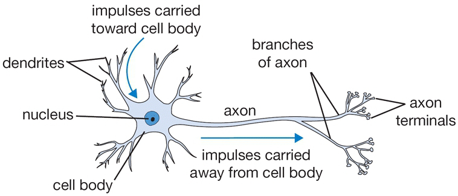
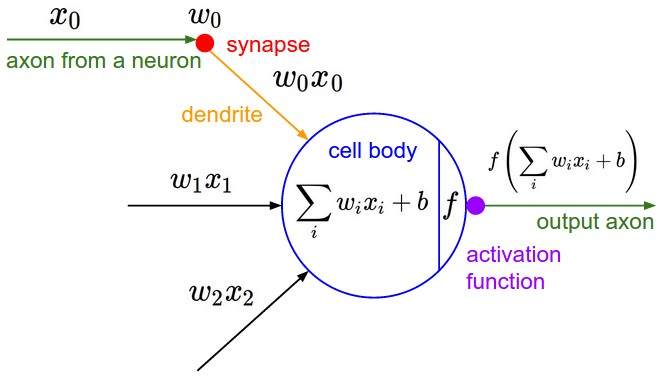

# Lecture 4

## 链式求导与梯度传播

前向传播：逐层计算，最后得到 Score / Loss

### 反向传播

通过链式法则：

$$ \frac{\partial L}{\partial x} = \frac{\partial L}{\partial z} \cdot \frac{\partial z}{\partial x} $$

最后一级的L对z偏导求出后反向传给 `z/x` 这一级，从而可以计算出**原始的** `x` 要素对**最终损失函数值**梯度上的影响。

L可以是 SVM / softmax 的loss函数。

在正 / 反向过程中处理函数主要有三种：

* add gate - 加法运算，将 `z = x + y` 上游梯度值**还给上一级**的x和y两个变量
* max gate - 取最大值，选择回溯路径而将另一端置0
* multiply gate - 将 `z = xy` 中x和y的值交换，并乘以上游梯度值回溯

特征：

* staged computation：把复杂表达式拆成中间变量，再反向逐步求导。
* forward cache：需要缓存前向传播中的中间变量。
* 分叉处梯度要累加：同一个变量流向多个分支时，反传用 +=。

实际上在每一级所做的是**矩阵加法和乘法运算**和sigmoid / 倒数等其他的gate；这里只是对此建立一个直观上的认知

传播过程实际上转换成为一个一个图遍历运算

## 神经网络 neuron network

只是**粗略模型**。

### 激活函数

* sigmoid函数，它会强行把输出结果平滑地压缩到 (0, 1) 区间内
  * 缺点：
    * 并不是以0为中心的输出，可能会对后续梯度符号产生影响
    * 且反向会出现**梯度消失**
* 双曲正切函数 tanh(x)
* ReLU 计算 `f(x)=max(0,x)`
  * 正值线性输出不会饱和
  * 不涉及复杂运算
  * 处理到负值时会失效，受学习率影响大
* Leaky ReLU 负值时乘以一个小的斜率值（比如0.01）防止失效
* Maxout 计算两个linear classification的最大值

### 整体架构

层数与神经元数目看中间（隐藏层）层数。

相邻层之间**全相联**，但**同一层内部不相联**。

**每一层**神经元组成一个**大的权重矩阵W**，即每一个神经元内**只包含一个向量**去和输入它的x做点积，然后通过**激活函数**输出。

对应实际逻辑相当于**先看边缘线条，再看脸型，最后对应是谁**。

此外，根据万有近似定律，理论上**单层**就可以完成对任意连续函数的拟合，但是考虑到实际工程实现的计算量和复杂度，会使用多层神经网络。

在神经元数和层数的选择上同样也会出现**过拟合**问题，在神经元数目多时明显，需要比如**正则化**的优化方法。
