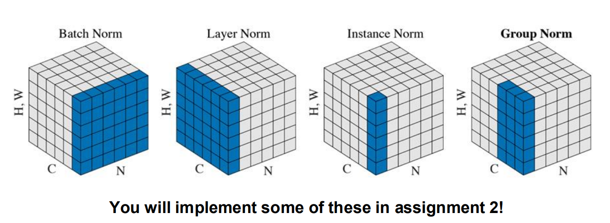
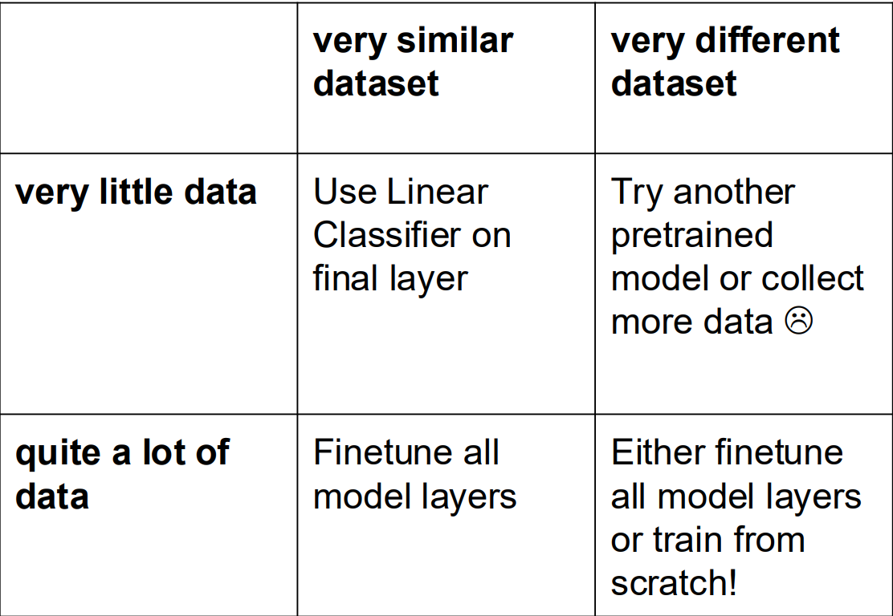

# Lecture 5 & 6

## 架构

一个简单的架构包括：

* input 输入层
* Conv 卷积层
* ReLU 激活层
* Pool 池化层
  * 减少计算量，防止死板，将图片区块采样
* FC 全连接层，计算得分

Pipeline形式：

`INPUT -> [[CONV -> RELU]*N -> POOL?]*M -> [FC -> RELU]*K -> FC`

### Convolutional Layer

直觉上是 consist of a set of learnable filters，也可以从大脑 / 神经元的模拟视角理解。

这些过滤器是一个个小区块（常用 3\*3 or 5\*5），颜色维数和图片本身相同。每一个filter**滑动过**整个图片，每步和对应像素**点乘**，得到一个函数值，最后形成二维的**activition map**。

每一个filter会对特定的视觉特征敏感；底层网络学会看线条、颜色块；高层网络学会看蜂窝、车轮等复杂图案。

将这些二维激活图叠成三维，作为下一层的输入。

过程的**超参数**有三个：

* depth - 用多少个filter
* stride - 步长
* zero-padding - 给画幅外面铺垫零的厚度，控制输出图的尺寸

**共享参数**是指所有的神经元（看作切片）对于同一个filter采用的是**同一套参数**构成的矩阵。

其**反向传播**过程同样也是卷积。

变体：

* 1x1 convolution - 针对三维的输入，采用1*1尺寸扫描，来压缩维数
* dilated convolution - 空洞卷积，在filter中加入空项，扩大相同矩阵参数规模下采样视野
  * dilate = 1，能让3\*3范围实际看到5\*5

*卷积层只有一层吗？*

**不是**，可以层层叠加。

### Pooling Layer

取max值之外也有*平均 / L2范数*等形式。

反向传播：和前面介绍相同，只和max路径有关。

### Normalization Layer 归一化层

让输入数据和各层激活值的分布保持稳定，从而让模型训得更快、更稳。

主要类型：

此外dropout的方法不适用，只有局限的小部分场合可用。

## 案例学习与实现细节

* VGGNet
  * 卷积层使用小尺寸filter, with stride = 1
* ResNet
  * 背景：堆卷积层层数太多反而会降低正确率
    * 本质上是**优化**问题，更深层的模型有更强的解释能力，但是优化难度大
    * 解决：残差模型绕过原本线性的 Conv - ReLU - Conv，卷积层只需要学习**残差**即可
      * 从拟合x从输入到输出的 `H(x)` 变成拟合 `F(x) = H(x) - x` 即输出和输入的差值
      * 降低学习难度，可以权重设0
      * 反向传播时避免梯度出现问题

## 数据学习处理

* 初始化
* 随机化处理 - 将同一个图随机地镜像 / 遮盖一部分 / 改亮度曝光度等方法，最后将各种随机的输出结果加权
* Transfer learning: 没有很多样本的时候
  * 先只激活一小部分深层的FC层，给一个小的数据集训练（后面的层更specific）
  * 再把所有层纳入考虑，给大的数据集训练（前面的层更generic）

* 超参数选取

## 内存开销

* 直接的各种数据容量大小
* 参数占比大小
* 杂乱信息，可能包括各种历史版本信息，原始图像信息等
