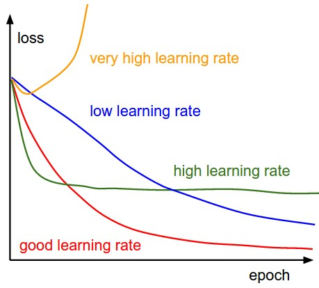
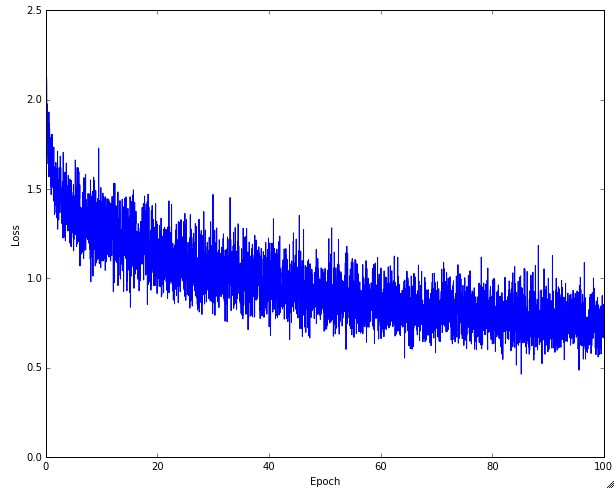

# Lecture 6

## 检查手段

### 梯度检查

目的是**检查**解析梯度和数值梯度区别，防止解析梯度代码实现时错误。

测试时会先用**小样本量**跑一遍梯度检查，保证在一定精度范围内。

* 使用 `(f(x+h)−f(x−h))/2h` 形式
* 使用**相对误差**
* 使用双精度浮点数检查
* 保证浮点数误差在一定范围内
* 追溯不可微的**拐点**
* 用少量数据
* 控制好差值h，比如 `1e-4` 或 `1e-6`
* 检查该保证在全局上有效
* 不让正则化处理影响过大掩盖数据
* 不使用dropout / 增强
* 只检查一部分维度

### 学习前检查

检查学习函数的工作性能，以及可以先过拟合一小部分样本以初始化。

### 学习中期

#### 图线分析

Loss-Epoch 曲线：




摆动幅度和**单批处理数据量大小**有关。


#### 其他参数方法：

* 观察Update情况相对于原数据的量级（一般在 `1e-3` 数量级好一点）
* 可以通过前期学习时激活函数是否饱和等，来验证**初始化**做的好不好
* 视觉上第一层神经网络的噪点特点特征应该是**比较干净**

## 参数更新方法

### 改变步长

```python
# Vanilla update
x += - learning_rate * dx

# Momentum update
v = mu * v - learning_rate * dx # integrate velocity
x += v # integrate position
```

考虑到**动量**的优化。

```python
x_ahead = x + mu * v
# evaluate dx_ahead (the gradient at x_ahead instead of at x)
v = mu * v - learning_rate * dx_ahead
x += v
```

简单的变种。

### 随时间削弱学习率

可以采用

* 线性方法
* 指数函数
* 1/t

等形式。

二阶方法：类似于牛顿迭代，二阶地迭代一次梯度。但是实际上**计算Hessian矩阵开销过于庞大**。

实际上有一些**模拟**牛顿迭代法的方法。Among these, the most popular is L-BFGS，但是它的方法要求对所有训练数据全部计算。

### 基于参数的自适应学习方法

让学习曲线逐渐变得平滑。

```Python
# Assume the gradient dx and parameter vector x
cache += dx**2
x += - learning_rate * dx / (np.sqrt(cache) + eps)
```

Adagrad 方法。

```Python
cache = decay_rate * cache + (1 - decay_rate) * dx**2
x += - learning_rate * dx / (np.sqrt(cache) + eps)
```

RMSProp 方法。
decay_rate is a hyperparameter and typical values are [0.9, 0.99, 0.999].

```Python
m = beta1*m + (1-beta1)*dx
v = beta2*v + (1-beta2)*(dx**2)
x += - learning_rate * m / (np.sqrt(v) + eps)
```

Adam 方法。

### 超参数优化

* 实现上依靠worker去跑监测点、吐日志等，由Master调度。
* 做cross-validation
* 在相应适合的量级内取值实验
* 随机化地找超参数
* 不要尝试在边界取优值
* 将搜索步骤从粗略到精细逐步展开
* 贝叶斯优化方法

## 多模型 model ensembles

训练多个模型，综合权重得到prediction。

* 同一套架构，采用不同超参数
* cross-validation发现效果好的
* 单个模型设不同checkpoints
* 取参数平均

缺点是时间成本高。