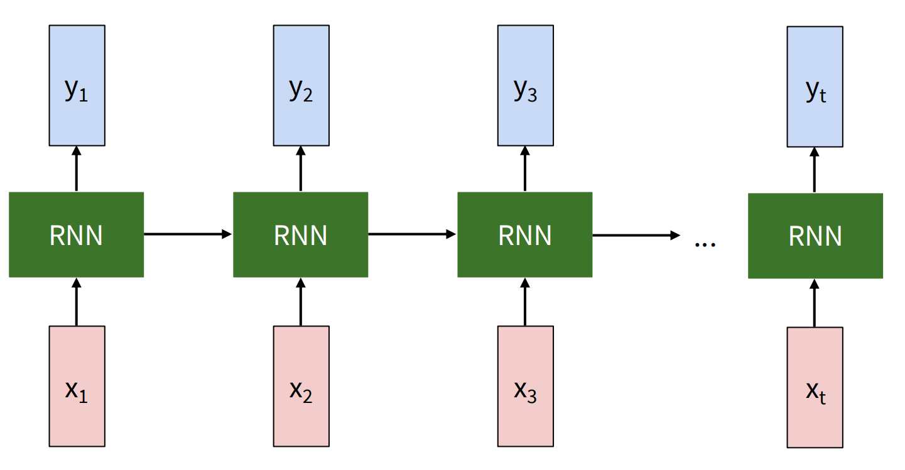
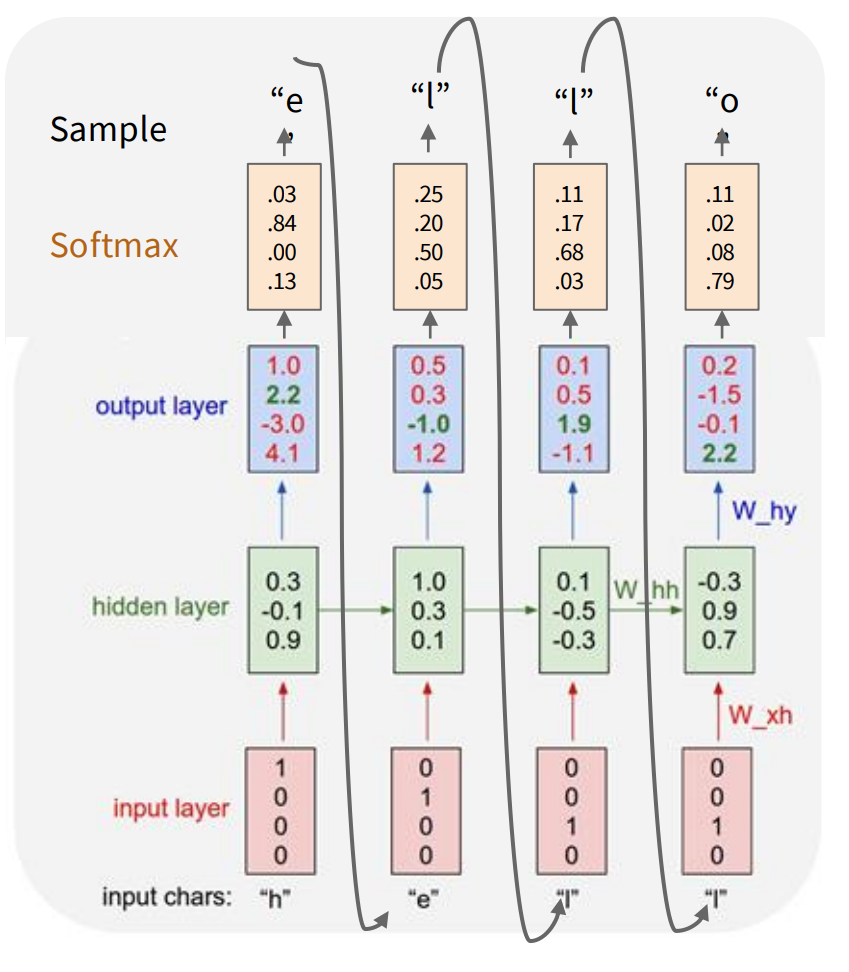
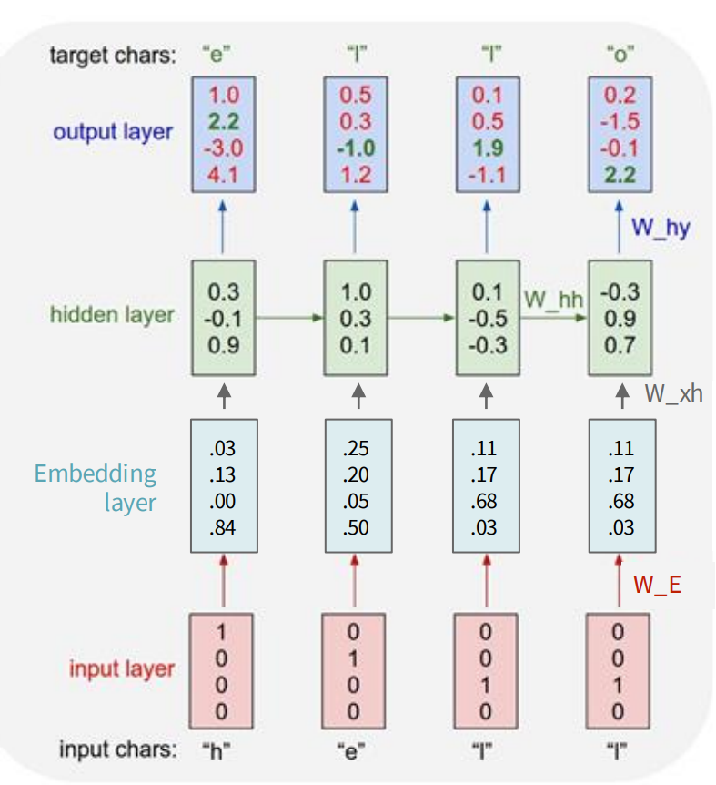
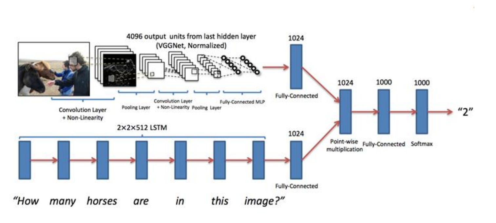
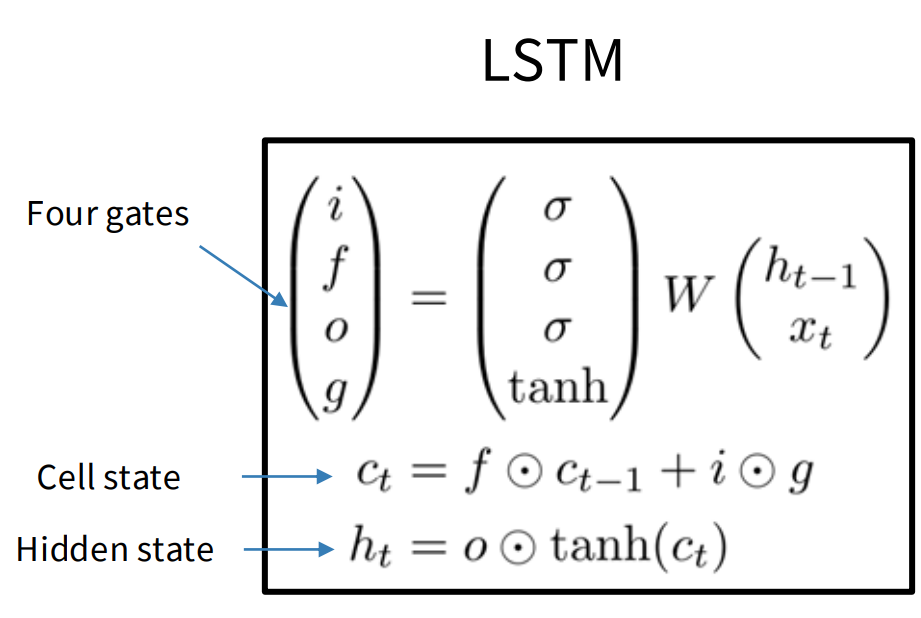
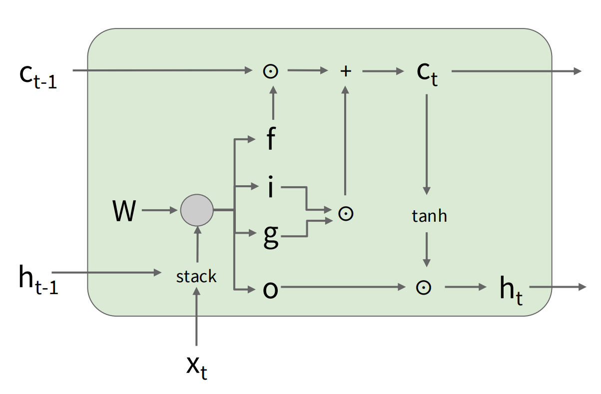

# Lecture 7

## Recurrent Neural Networks

特点：把上一步的输出藏进当前步的隐藏状态里，和当前步的输入一起进行计算。

隐藏向量的初始化计算：

$$h_t = \tanh(W_{hh}h_{t-1} + W_{xh}x_t + b_h)$$

然后得到：

$$y_t = W_{hy}h_t$$

$W_{hh}$ 和 $W_{xh}$ 和 $W_{hy}$ 是权重参数，它们在所有时间步里都是**共享（Shared）**的

最后Loss可以由各部分y的值统合贡献得到。

核心**思想**：Hello的案例里面，通过历史记忆结合，推测下一个字母最大概率出现的是哪一个。

在hidden layer 和输入之间插入 **embedding layer** 可以使权重矩阵**降维**和**稠密化**。

这是当下 OpenAI Codex, GitHub Copilot, Claude Code, Cursor IDE 等运作的方法，也可以用来生成代码等。

也可以引入探测代码块里面的if语句，行列长度等。

不足：

* 计算速度慢
* 难以使用到过于久远的记忆

可以运用到实际的**文字搜图**等方面：  
token的流动相当于 `<start> -> "woman" -> "cat" -> <end>` 结合之前学习的视觉识图等做出综合决策

也可以使用多层的 hidden layer 搭建高维的RNN。

## LSTM

问题：过多层数的RNN反向传播会导致梯度消失（每层梯度值总是小于1）；反过来，（非线性地）如果总是大于1，最后又会导致**梯度爆炸**。

* 针对大于1的情况，可以截断梯度范数到阈值。
* 针对小于1的情况，需要改进RNN架构。由此引出LSTM。

由 `i` `f` `o` `g` 四个门控制审查，可以看到前三个门使用 `sigmoid` 函数，第四个门使用 `tanh` 函数。

* `i`: Input gate, whether to write to cell
* `f`: Forget gate, Whether to erase cell
* `o`: Output gate, How much to reveal cell
* `g`: Gate gate (?), How much to write to cell

这四者分别由**独立的权重矩阵**所控制。

`c_t` 和 `h_t` 两者，前者在时间线下变动得小，负责**长线**记忆；后者通过tanh函数激活，负责表面**短线**记忆

对于C的反向传播：只牵涉到和f的点乘，Uninterrupted gradient flow，并不受到tanh函数失真干扰

类似于**ResNet**的实现。

Modern RNN 的实现和优点：不受限的上下文长度，表现和训练量正相关线性
