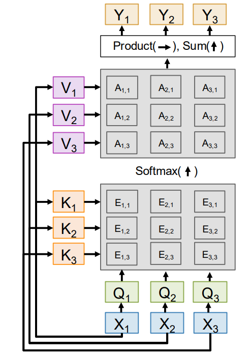
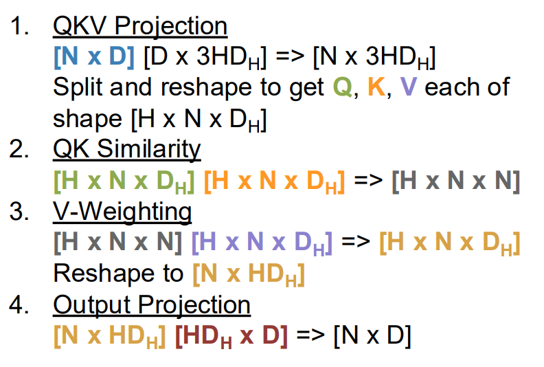
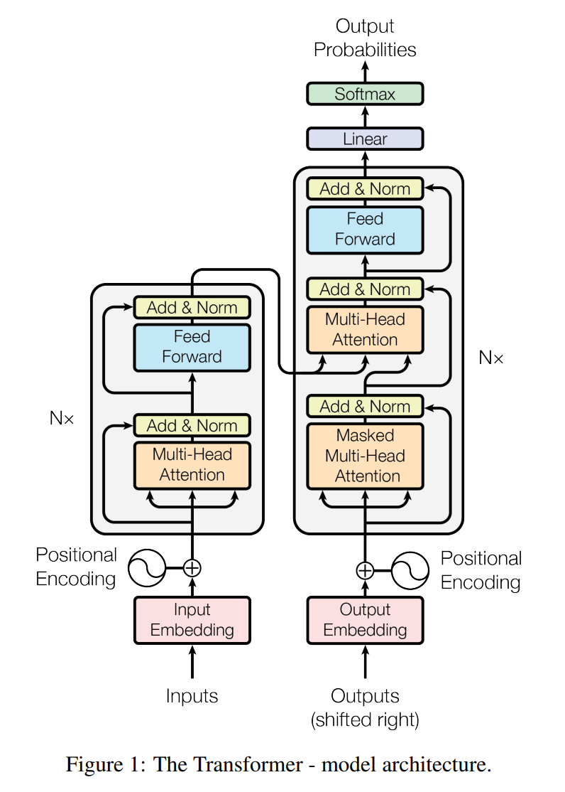
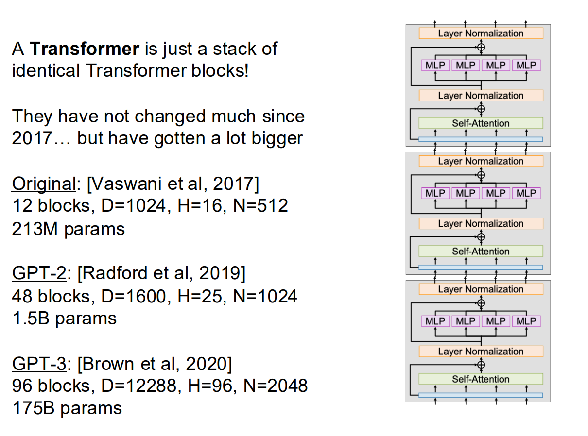

# Lecture 8

## Attention

实际做一个**语言翻译**的场景：

传统的RNN流程是：先把A语言的一句话扔进训练（encode），结束后得到 Context vector c (often c=h_T)

同时又有 Initial decoder state s0

在decode的训练过程中的解决方法：Look back at the whole input sequence on each step of the output

问题：对于长文本的处理能力和长期记忆比较差

### RNN with Attention

注意 `e_ti` 由 `h_i` 与 `s_t-1` 统合计算得到。当decoder想要翻译下一个词语的时候，会带着 `s_t-1` 的状态跑一遍整个源文本的隐式状态并做对比，然后计算得到 `e_ti`，通过softmax以及标准归一化得到权值 `a_ti`。

新一轮的context向量由注意力权重a对注意力隐状态加权得到。

### Similarity 计算的改进

* 点积除以 \(\sqrt{d_k}\)，避免维度增大导致 logits 过大、Softmax 饱和
* 将查询序列向量q包装 - Multiple query vectors

### Cross-Attention Layer

但是现在的计算（线性计算）是直接拿着Query和原始数据向量X做**点积**，因此需要引入可学习的参数矩阵 `W_K` 和 `W_V`，将原始数据X映射到新的特征空间。

即有 `K = X * W_K` 以及 `V = X * W_V`，同时解放了Q的维度上的限制。

- 这意味着源序列与目标序列的长度可以不同
- 对于Decoder里面加入了encoder输出那一层Cross-Attention Layer而言**不同**
- 对于Self-Attention Layer而言，**两者是相同的**

### Self-Attention Layer

自注意力机制。

每一个输入向量，通过矩阵运算得出Q / K / V。三者在设计上解耦，保证模型的思考能力和架构灵活度

问题：在 Self-Attention Layer 中，模型收到整个矩阵的输入，并不知道时序，没法权衡有序性带来的影响。

解决：

* 通过一个固定的位置编码向量来提醒Attention机制时序关系
* 改进（RoPE)：将向量根据在正文中位置，用旋转矩阵旋转一个角度后做矩阵乘法；看夹角比较时序
  * $$\text{Attention Score} = (q_0 k_0 + q_1 k_1) \cos(\phi_j - \theta_i) + (q_1 k_0 - q_0 k_1) \sin(\phi_j - \theta_i)$$
  * 避免硬编码兼容性差
  * 可以通过夹角正负与sin项来设置对前项 / 后项的区分和注意侧重
  * 随距离变大衰减的特性

### Masked Self-Attention Layer

使用**掩码**，Override similarities with -inf; this controls which inputs each vector is allowed to look at.
    * 即为 **Masked Self-Attention Layer**.

### Multiheaded Self-Attention Layer

同时跑H个独立的 Attention Layer，采用批量矩阵乘法操作。

通过 `Flash Attention algorithm` 将GPU内存占用从 `O(N^2)` 降维成 `O(N)`，避免一次操作整个矩阵  
但是时间复杂度是 `O(N^2)`

## 三种读取序列文本的方式

* 卷积
* RNN
* Attention

> Attention is All You Need.

## Transformer

包含**encoder**和**decoder**这两部分。

### 工作流程

比如先把一个句子 `我是中国人` 翻译成日语：

Encoder端：

- 先分词转换为 token ID，给出对应输入向量X
  - Encoder的输出已经对整个句子**有了语义和上下文的理解**
  - 只对原句子执行了一遍计算

Decoder端：

- 以特殊起始标记 `<BOS>` 作为初始输入，而不是以中文的“我”作为输入。
- 通过掩码遮住未来的token
- 在写每一个token的时候，decoder不仅会看自己前面已经写了什么，还会不断地回顾（也就是使用注意力）
  - **首先**通过 Masked Self-Attention 处理当前已有的日语前缀
  - **然后**通过 Cross-Attention 读取 Encoder 输出

那么对于整个句子：

\[\langle BOS\rangle\rightarrow \text{私}\rightarrow \text{は}\rightarrow \text{中国人}\rightarrow \text{です}\rightarrow \langle EOS\rangle\]

- 输入 `<BOS>`，Decoder 根据源句子和起始标记预测第一个目标 token“私”。
- 将已经生成的“私”追加到 Decoder 的目标语言前缀中，预测下一个 token“は”。
- 将“は”继续追加到目标语言前缀中，预测“中国人”。
- 根据源句子表达的判断关系、已经生成的“私は中国人”以及模型学到的日语语法，预测“です”。
- 当模型预测 `<EOS>` 时，生成过程结束，最终得到“私は中国人です”。

KV-cache的作用：

在每一步生成时，如果重新计算此前所有日语 token 的 (K) 和 (V)，会产生大量重复计算。

因此，Decoder 会在每一层保存此前目标 token 的 Key 和 Value。生成新 token 时，只需要：

- **计算新** token 对应的 Query、Key 和 Value；
- 将新的 Key、Value追加到该层的 KV Cache；
- 使用新 Query 对缓存中的所有 Key、Value执行注意力计算。

Encoder 的输出在整个解码过程中保持不变，因此 Cross-Attention 使用的 Key 和 Value也可以预先计算并重复使用。

### Transformer Block

一个Transformer单元包括：

* Self-Attention Layer 与 ResNet（残差学习，保留原始信息，方便梯度传播）
* Normalization Layer
* MLP 与 ResNet
  * MLP 用来 线性升维 - 非线性激活 - 线性降维
  * 它不负责看上下文，只负责在每个位置上独立地打磨、升级特征
* Normalization Layer

多个单元堆叠，加上头尾的 Embedding Matrix (V\*D) 和 Projection Matrix (D\*V) 处理原始输入和自然语言输出，在目标维度下讨论。

### Vision Transformer

分区摊开，分别转换成D维数向量作为Input Vectors

* Transformer gives an output vector per patch
* 不必须需要设置Mask
* 可以用位置编码来确认对应的二维坐标

计算分数：Average pool NxD vectors to 1xD, apply a linear layer D=>C to predict class scores

### 改进与其他形式

* Pre-Norm Transformer
  * 把Normalizaion放在了ResNet里面，让训练稳定
* QK-Norm
  * RMSNorm 标准化了Q和K矩阵，使训练更稳定
* SwiGLU MLP
  * 中间使用两个矩阵，输入未激活乘以W1，激活乘以W2，两者再点乘
* Mixture of Experts (MoE)
  * 使用很多套不同的MLP参数权重
  * 每个MLP都是一个专家，Each token gets *routed* to A < E of the experts.
