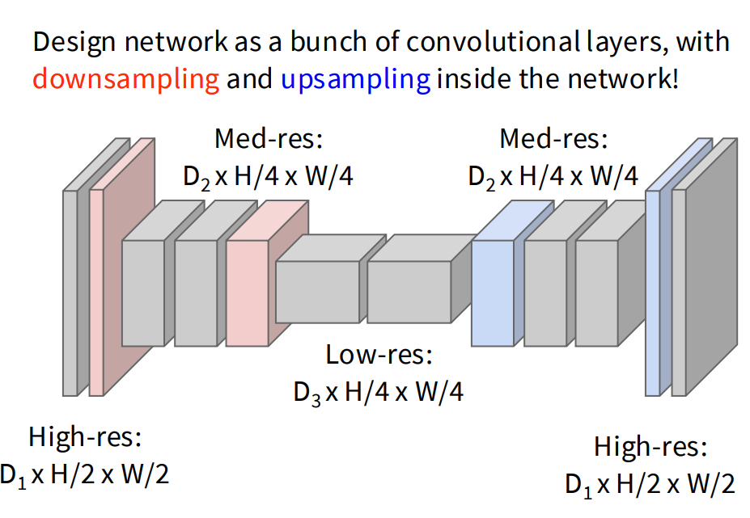
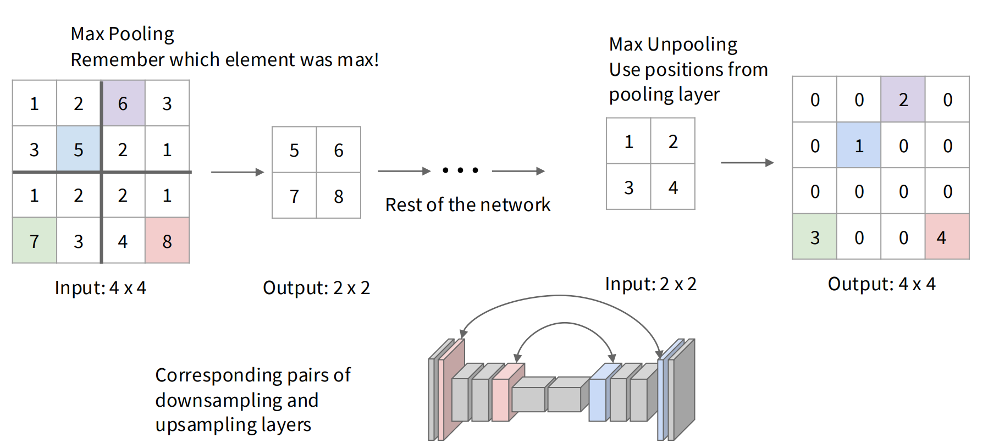
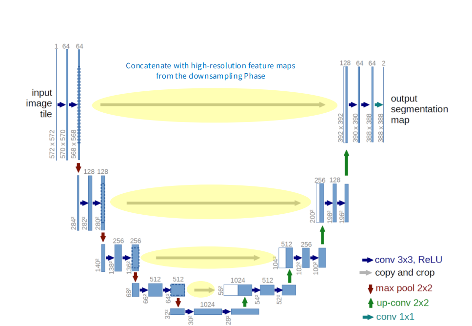
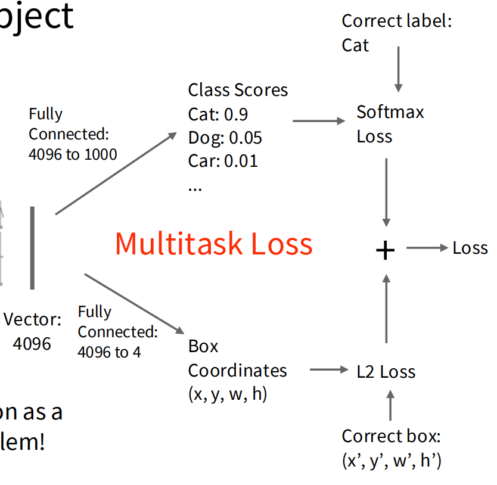
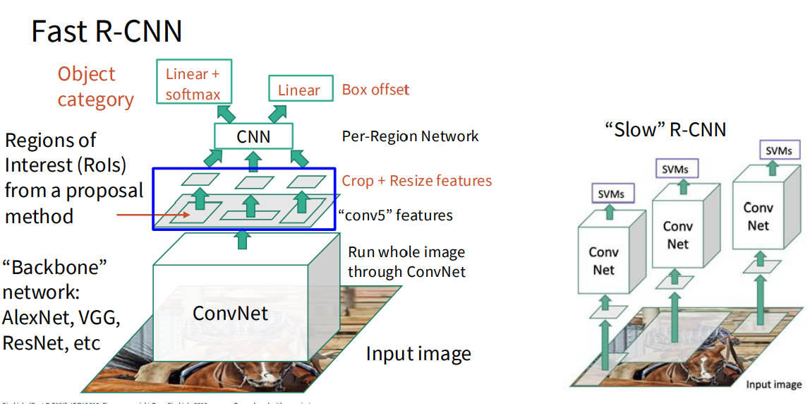
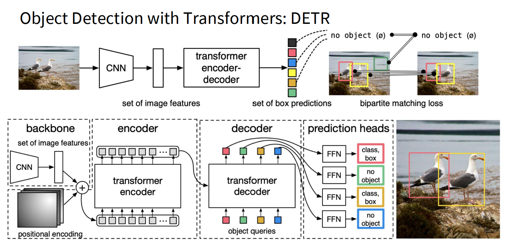
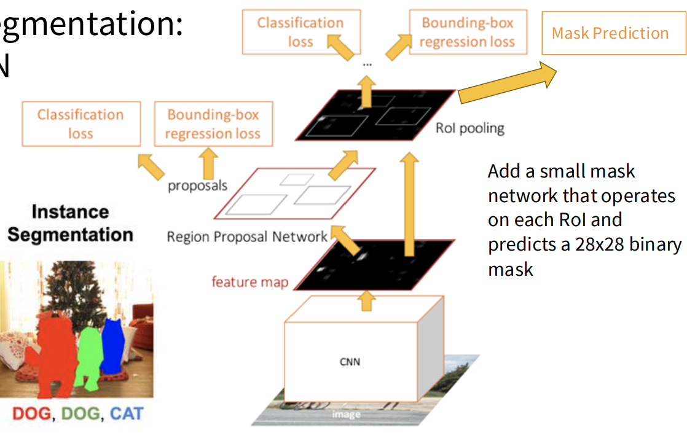
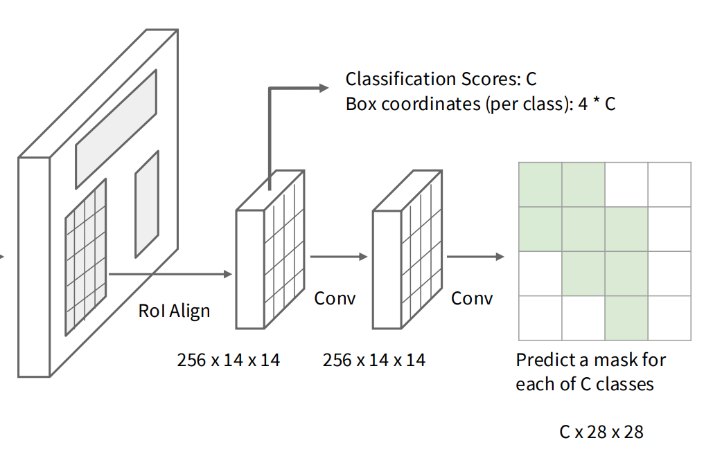

# Lecture 9

## Computer Vision Tasks

任务包括

* Semantic Segmentation
* Object Detection
* Instance Segmentation

### Semantic Segmentation

* 训练过程：Paired training data: for each training image, each **pixel is labeled** with a semantic category.
* 测试过程：**classify each pixel** of a new image

考虑Silding Window（遍历所有）:

* 区间不能太小，因为要囊括Context
* 考虑一个区块，用CNN探测中心像素并分类
  * 缺点：效率低，没有复用同一个Context

考虑做**卷积**：

* 问题：卷积一般最后会减小特征的空间规模，但是 Semantic Segmentation 会要求输出规模和原图相同。
* 不降维的卷积的问题：首层开销会很大
* Downsampling + Upsampling

#### Unpooling

Upsampling过程涉及到反池化Unpooling。

例如从2\*2 -> 4\*4 的规模，可以批量设置2*2方块最近邻的数值；也可以把多出来的批量设0

进一步有Max Unpooling方法。

#### Transposed Convolution 转置卷积

卷积核参数可学习，直接乘以输入，将输入映射到对应的大区域。

区域与区域间的重叠部分是可以叠加的。

#### U-Net

### Object Detection

单个物体的探测，涉及到**Multitask Loss** 和 联合学习，需要学习矩形框定范围的L2 Loss和标签分类的Softmax。

多个物体的情况：

* 拿每一个Label都跑一遍对应检测
  * 问题：效率低，计算开销大
  * 解决：Selective Search

#### R-CNN

比较慢的方法是：提取约2000个RoI (Regions of Interest) 然后把它们变形成特定像素大小，再进行卷积学习，计算SVM

快的方法：Run whole image through ConvNet，然后再根据特征提取RoI进行分析等操作

* 优势：先提取特征再计算，可以减少对特征重复计算
* 可以反向传播计算出原像素

#### Region Proposal Network

实际训练时对同一个中心坐标像素采用不同的K个截取框，排序后筛查出得分最高的

#### 实际实现

* YOLO (You Only Look Once)
  * 把图片分成网格，用来确定区间内的物体类别
  * For each box output:
    * P(object): probability that the box contains an object
    * B bounding boxes (x, y, h, w)
    * P(class): probability of belonging to a class
  * 也就是确定格子里有东西及东西所属类别的**概率**。

* Object Detection with Transformers (DETR)

优势：能结合全局的Context

注意这里的Query输入相比传统NLP，它是独立的不由 `W_Q` 决定的；可以反向传播更新

### Instance Segmentation

Semantic Segmentation 只分类区块而没有个体个数；Object Detection 区分了个体但边界粗糙。

Instance Segmentation 统合分类与个体。

改进在于

* 在每一个RoI里面应用一个 28\*28 的 Binary Mask，做卷积网络，用于预测区块对应图形轮廓
  * 将RoI提取成一个14\*14的特征图，卷积后分辨率变成28\*28

## Visualization & Understanding

涉及到对视觉处理网络的黑箱和直观理解。

* First Layer: Visualize Filters - 在第一层可以看出一些Filter的纹理和噪声。
* Saliency Maps - 可以通过反向传播，检查各个像素的显著性和敏感性，标明成Saliency Maps。
* CAM (Class Activation Mapping) - 看最后一层卷积网络的决策权重图
* Grad-CAM (Gradient-Weighted Class Activation Mapping) - 计算Score对任意一层的梯度，将之作为权重表达区域的梯度敏感度
