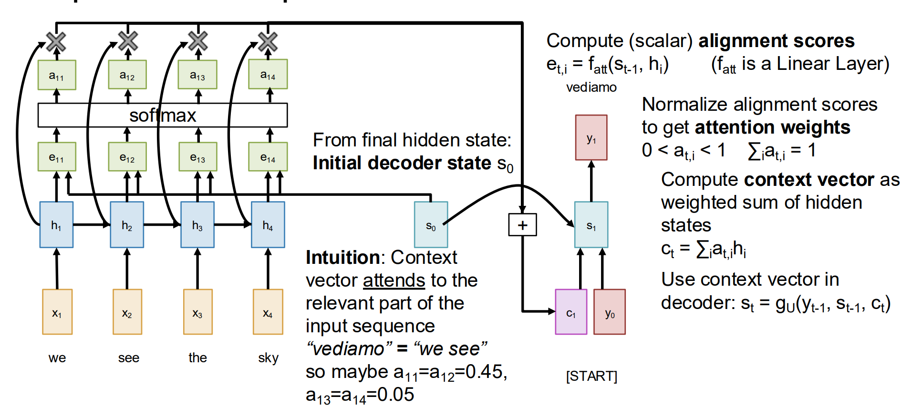
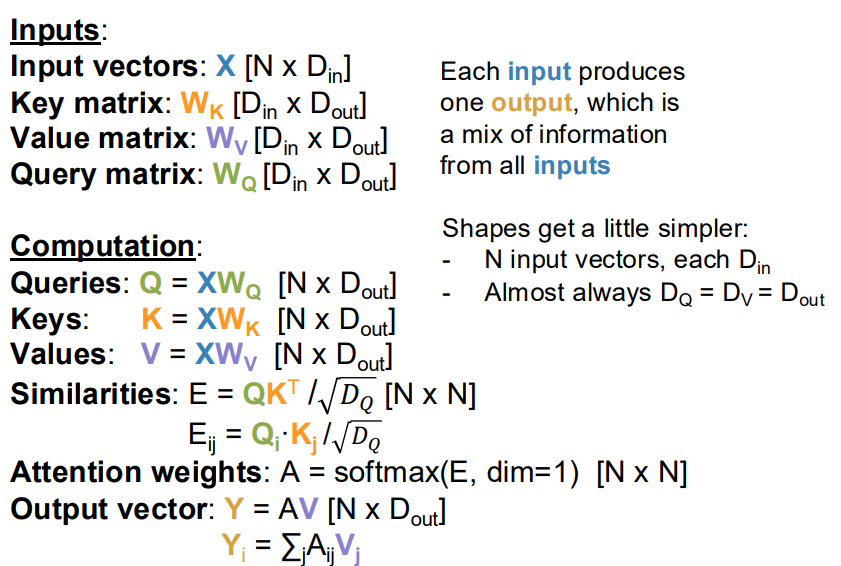

# Lecture 9

## Attention

实际做一个**语言翻译**的场景：

传统的RNN流程是：先把A语言的一句话扔进训练（endode），结束后得到 Context vector c (often c=h_T)

同时又有 Initial decoder state s0

在decode的训练过程中的解决方法：Look back at the whole input sequence on each step of the output

问题：对于长文本的处理能力和长期记忆比较差

### RNN with Attention

注意 `e_ti` 由 `h_i` 与 `s_t-1` 统合计算得到。当decoder想要翻译下一个词语的时候，会带着 `s_t-1` 的状态跑一遍整个源文本的隐式状态并做对比，然后计算得到 `e_ti`，通过softmax以及标准归一化得到权值 `a_ti`。

新一轮的context向量由各个时间的权重矩阵对a加权得到。

### Similarity 计算的改进

* 将函数值除以标准差归一化，防止梯度消失
* 将查询序列向量q包装 - Multiple query vectors

### Cross-Attention Layer

但是现在的计算（线性计算）是直接拿着Query和原始数据向量X做**点积**，因此需要引入可学习的参数矩阵 `W_K` 和 `W_V`，将原始数据X映射到新的特征空间。

即有 `K = X * W_K` 以及 `V = X * W_V`，同时解放了Q的维度上的限制。

### Self-Attention Layer

自注意力机制。

每一个输入向量，通过矩阵运算得出Q / K / V。三者在设计上解耦，保证模型的思考能力和架构灵活度

问题：在 Self-Attention Layer 中，模型收到整个矩阵的输入，并不知道时序。

解决：
* 通过一个固定的位置编码向量计算是否符合时序；缺点是文本长度长的时候效率低
* 改进：将向量根据在正文中位置，用旋转矩阵旋转一个角度后做矩阵乘法；看夹角比较时序
  * $$\text{Attention Score} = (q_0 k_0 + q_1 k_1) \cos(\phi_j - \theta_i) + (q_1 k_0 - q_0 k_1) \sin(\phi_j - \theta_i)$$
  * 只需根据维度设定单位角度这一个参数即可；避免硬编码兼容性差
  * 可以通过夹角正负与sin项来设置对前项 / 后项的区分和注意侧重
  * 随距离变大衰减的特性

### Masked Self-Attention Layer

在计算完MoPE的向量旋转之后，  
使用**掩码**，Override similarities with -inf; this controls which inputs each vector is allowed to look at.
    * 即为 **Masked Self-Attention Layer**.

### Multiheaded Self-Attention Layer

同时跑H个独立的 Attention Layer，采用批量矩阵乘法操作。

通过 `Flash Attention algorithm` 将GPU内存占用从 `O(N^2)` 降维成 `O(N)`，避免一次操作整个矩阵  
但是时间复杂度是 `O(N^2)`

### 工作流程

比如先把一个句子 `我是中国人` 翻译成日语：
* 先分词给出对应输入向量X
* 对应计算出Q / K / V，存进 KV Cache 中
* 矩阵旋转计算
* 设置掩码
* 先把 `我` 经过计算，**输出** `私（+主格助词は）`
* 把 `我` 后塞进这个输入向量X中，再把向量X喂给输入
  * 实际上只需要计算新加入的 `我` 即可
* 与上述同理，遇到 `是` ，计算得到空白（跳过）
* 与上述同理，遇到 `中国人` 经过计算输出 `中国人`，把 `中国人` 后塞进这个输入向量X中，再把向量X喂给输入
* 此时中文已经结束 `<sep>`，但它激活了对应的权重矩阵，对应规则是
  * 从中文翻译成日语，且句子结束，补充前面的谓语
  * 从而使Attention注意到 `是` 上，补充了 `desu`
* 最后得到 `私は中国人です`

## 三种读取序列文本的方式

* 卷积
* RNN
* Attention

> Attention is All You Need.

## Transformer

一个Transformer单元包括：
* Self-Attention Layer 与 ResNet（残差学习，方便溯源）
* Normalization Layer
* MLP 与 ResNet
  * MLP 用来 线性升维 - 非线性激活 - 线性降维
  * 它不负责看上下文，只负责在每个位置上独立地打磨、升级特征
* Normalization Layer

多个单元堆叠，加上头尾的 Embedding Matrix (V\*D) 和 Projection Matrix (D\*V) 处理原始输入和自然语言输出，在目标维度下讨论。

### Vision Transformer

分区摊开，分别转换成D维数向量作为Input Vectors
* Transformer gives an output vector per patch
* 不需要设置Mask
* 用位置编码来确认对应的二维坐标

计算分数：Average pool NxD vectors to 1xD, apply a linear layer D=>C to predict class scores

### 改进与其他形式

* Pre-Norm Transformer
  * 把Normalizaion放在了ResNet里面，让训练稳定
* QK-Norm
  * RMSNorm 标准化了Q和K矩阵，使训练更稳定
* SwiGLU MLP
  * 中间使用两个矩阵，输入未激活乘以W1，激活乘以W2，两者再点乘
* Mixture of Experts (MoE)
  * 使用很多套不同的MLP参数权重
  * 每个MLP都是一个专家，Each token gets *routed* to A < E of the experts.